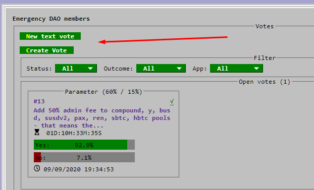
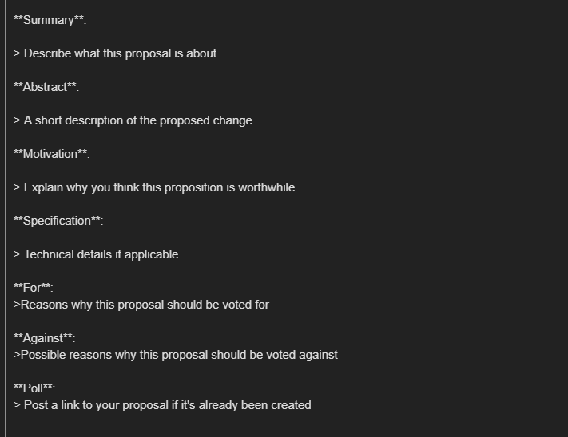

<h1>Создание предложения в DAO</h1>

Официальные предложения DAO — это единственный способ внести обязательные изменения в протокол Curve. В настоящее время существует два типа голосований: параметрические и текстовые.

- Параметрические голосования (Parameter votes) автоматически фиксируются в DAO через три дня после их принятия в конце голосования. 
- Текстовые предложения (Text proposals) отличаются, так как они часто требуют разработки. Для них рекомендуется обсудить с командой Curve, чтобы понять осуществимость и создать сигнальное предложение.

Перед созданием голосования в блокчейне имеет смысл провести предварительное обсуждение на [форуме управления](https://gov.curve.fi/), особенно если тема имеет большое значение.

Для фактического создания голосования в блокчейне требуется 2500 `veCRV`. (1)
{ .annotate }

1. Но не беспокойтесь, мой друг. Если у вас нет 2500 `veCRV`, есть много полезных членов сообщества, которые наверняка помогут вам создать его.

## **Создание вашего голосования** {#creating-your-vote}

Посетите Curve DAO: [https://dao.curve.fi/dao](https://dao.curve.fi/dao), выберите тип голосования и отправьте его.

## **Создание вашего предложения** {#creating-your-proposal}

Каждое предложение DAO должно сопровождаться предложением на форуме управления Curve. Посетите раздел предложений: [https://gov.curve.fi/c/proposals/8](https://gov.curve.fi/c/proposals/8) и нажмите **"New Topic"**.

Затем вам будет представлен шаблон, который поможет вам представить ваши предложенные варианты сообществу.

После этого обязательно взаимодействуйте с членами сообщества, у которых есть вопросы по вашему предложению.

