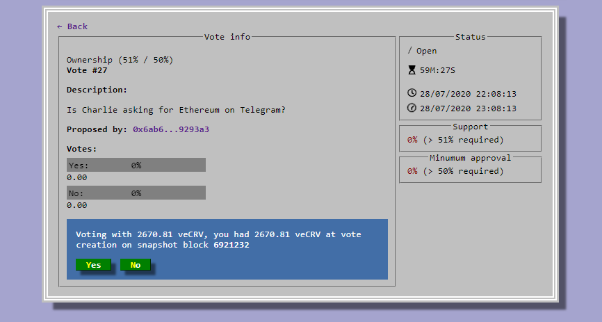

## **Как участвовать в управлении?** {#how-to-participate-in-governance}

Чтобы участвовать в управлении, пользователям Curve Finance необходимо [блокировать](../vecrv/locking-your-crv.md) (lock) свои CRV в хранилище для голосования (voting escrow).

Вы можете сделать это по следующему адресу: [https://dao.curve.fi/locker](https://dao.curve.fi/locker)

## **Что такое veCRV?** {#what-are-vecrv}

veCRV расшифровывается как voting escrow CRV (депонированный на голосование CRV). Это ваши CRV, блокированные для голосования. Чем на более долгий срок вы блокируете свои CRV, тем больше у вас голосовой силы (Voting Power) (и тем большего буста вы можете достичь). Вы можете блокировать для голосования 1,000 CRV на год, чтобы получить вес 250 veCRV.

Ваш вес veCRV постепенно уменьшается по мере приближения блокированных токенов к окончанию срока блокировки. График, иллюстрирующий это уменьшение, можно найти по адресу: [https://dao.curve.fi/locker](https://dao.curve.fi/locker)

Вы получите больше голосовой силы (Voting Power), блокировав свои CRV на более длительный период.

## **Могу ли я начать голосовать сразу?** {#can-i-start-voting-right-away}

Вы можете начать голосовать, но ваш голосовой вес фиксируется в блоке, в котором было создано предложение. Это означает, что ваш голосовой вес для конкретного предложения определяется на момент его создания. Если вы блокировали свои CRV после того, как предложение уже было создано, ваш голосовой вес для этого предложения не изменится.

## **Как голосовать?** {#how-to-vote}

Просто перейдите к выбранному предложению на сайте, нажмите на вариант голосования и подтвердите транзакцию. Вы можете найти предложения DAO по адресу: [https://dao.curve.fi/dao](https://dao.curve.fi/dao)

## **Где я могу узнать об управлении?** {#where-can-i-find-out-about-governance}

Вы можете посетить форум управления Curve Finance по адресу: [http://gov.curve.fi/](http://gov.curve.fi/)

