<h1>Как Брать Займы и Использовать Кредитное Плечо</h1>

## **Интерфейс Заимствования (Borrowing UI)** {#borrowing-ui}

При выборе вкладки **`"BORROW"`** на [основном интерфейсе](https://lend.curve.fi/#/ethereum/markets), отображается вся соответствующая информация о рынке и значения для заемщиков:

<figure markdown="span">
  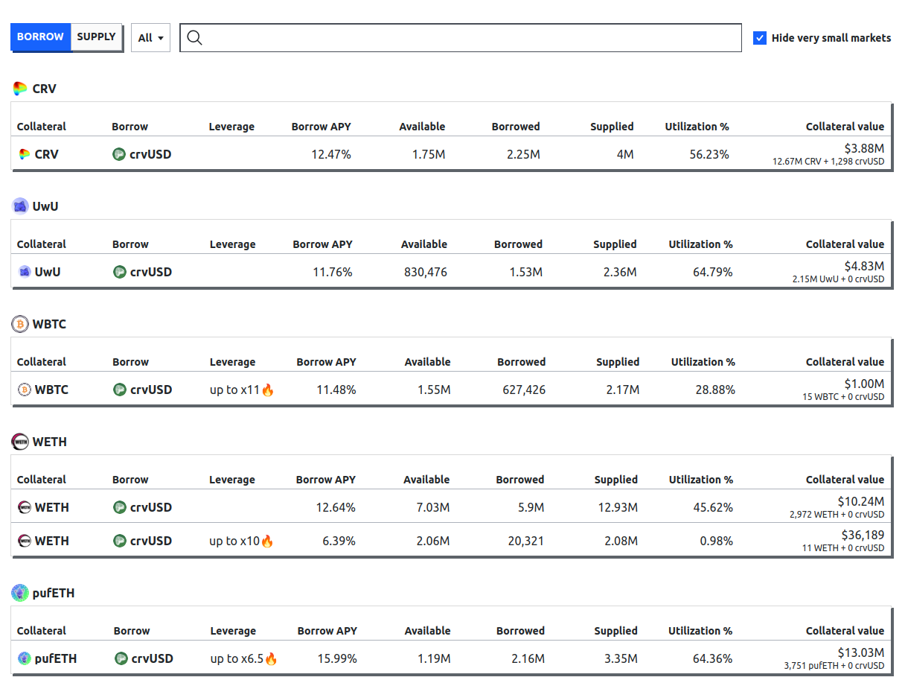{ width="800" }
  <figcaption></figcaption>
</figure>

`Collateral` отображает залоговый токен рынка, в то время как `Borrow` показывает токен, который можно занять. Столбец `leverage` показывает, доступно ли встроенное кредитное плечо на рынке.

`Borrow APY` представляет текущую [ставку заимствования](./overview.md#borrow-rate). Столбец `Available` показывает количество оставшихся для заимствования активов, а `Borrowed` — общее количество текущих займов.

`Supplied` показывает общее количество предоставленного токена, который может быть заимствован пользователями. `Utilization (%)` — это отношение `Borrowed` к `Supplied` токенам, см. [здесь](./overview.md#utilization-lend-apy-and-borrow-apy) для получения дополнительной информации.

---

## **Создание Нового Займа** {#creating-a-new-loan}

Для создания займа и заимствования токенов под залог, пользователь сначала должен выбрать кредитный рынок. Это можно сделать, просто кликнув по желаемому рынку.

Активировав **`"Advanced Mode"`** при создании займа, пользователь может дополнительно выбрать количество полос для займа и увидеть соответствующий диапазон ликвидации. Если режим не активирован, займ будет создан с использованием количества полос по умолчанию — 10.

<figure markdown="span">
  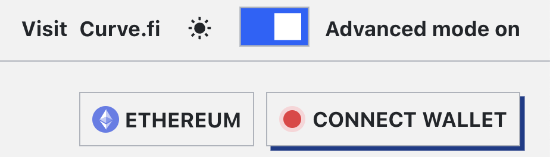{ width="300" }
  <figcaption>Advanced Mode можно переключить в верхнем правом углу страницы.</figcaption>
</figure>

!!!tip "Количество Полос (N)"
    **Большое количество полос приводит к меньшим потерям при режиме мягкой ликвидации**. Максимальное количество полос — 50, а минимальное — 4.

<figure markdown="span">
  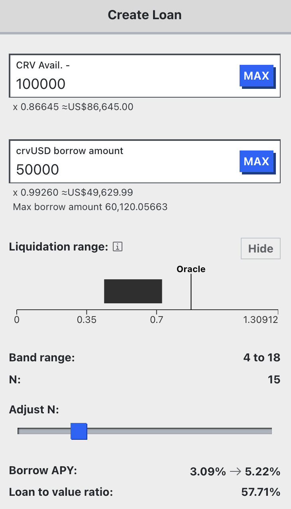{ width="300" }
  <figcaption></figcaption>
</figure>

Дополнительно интерфейс показывает ожидаемую ставку заимствования (`Borrow APY`) при создании займа и отношение займа к залогу (`Loan-to-Value`, `LTV`).

---

*Расширенный режим также предоставляет обзор всей системы LLAMMA, включая важные значения, такие как ставки по заимствованию (`Borrow APY`) и кредитованию (`Lend APY`), доступное количество для заимствования и т.д.*

<figure markdown="span">
  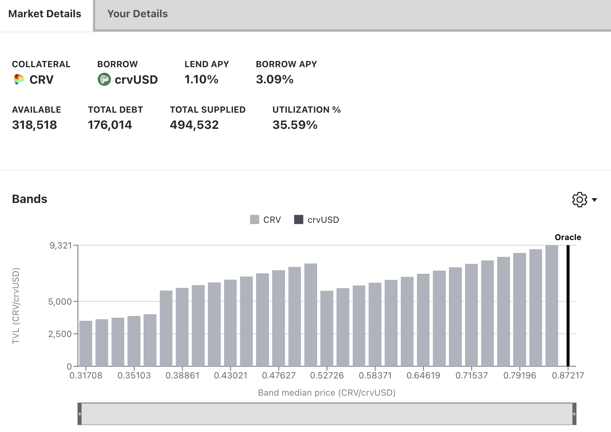{ width="600" }
  <figcaption></figcaption>
</figure>

*Ниже отображается раздел, содержащий соответствующие контракты и текущие параметры кредитного рынка.*

<figure markdown="span">
  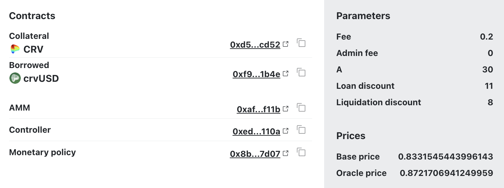{ width="600" }
  <figcaption></figcaption>
</figure>

- **`Fee`**: Текущая комиссия за обмен токенов в AMM.
- **`Admin Fee`**: Процент от общей комиссии, который начисляется держателям veCRV. В настоящее время все комиссии идут поставщикам ликвидности в AMM (которые являются заемщиками).
- **`A`**: Параметр усиления A определяет плотность ликвидности и размер полосы.
- **`Loan Discount`**: Процент, используемый для скидки залога при расчете максимальной суммы, которую можно занять при создании займа.
- **`Liquidation Discount`**: Процент, используемый для скидки залога при расчете восстановимой стоимости при ликвидации по текущей рыночной цене.
- **`Base Price`**: Базовая цена — это цена полосы номер 0.
- **`Oracle Price`**: Цена оракула — это текущая цена залога, определенная оракулом. Цена оракула используется для расчета стоимости залога и здоровья займа.

---

*Переход к вкладке `"Your Details"` отображает все детали займа пользователя:[^1]*

[^1]: Эта вкладка отображается только если у пользователя есть займ и его кошелек подключен к сайту.

<figure markdown="span">
  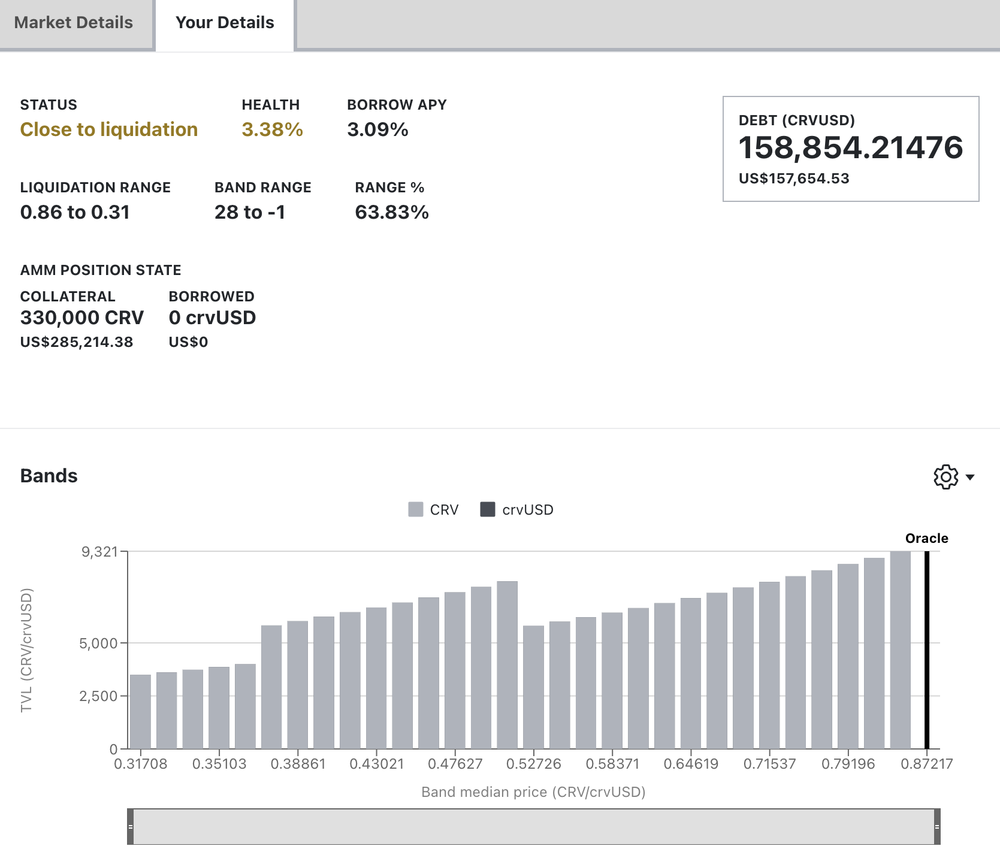{ width="600" }
  <figcaption></figcaption>
</figure>

---

## **Управление Займом (Loan Management)** {#loan-management}

!!!info "Управление Займом в режиме мягкой ликвидации"
    **Во время мягкой ликвидации пользователи не могут добавлять или выводить залог.** Они могут выбрать **либо частично, либо полностью погасить** свой долг в crvUSD, чтобы улучшить соотношение здоровья, **или** решить **самостоятельно ликвидировать** свой займ, если их состав залога содержит достаточное количество crvUSD для покрытия непогашенного долга. Если они выберут самостоятельную ликвидацию, долг пользователя полностью погашается, и займ закрывается. Любые остатки возвращаются пользователю.
    
Понимание того, как работают мягкие ликвидации, здоровье займа и жёсткие ликвидации, необходимо для управления займами на Curve. Обязательно прочитайте и поймите следующие разделы перед взятием займа:

- [**Понимание Мягких Ликвидаций**](./overview.md#soft-liquidation)
- [**Понимание Здоровья Займа и Жёстких Ликвидаций**](./overview.md#health-hard-liquidation)

Остальная часть этого раздела описывает, как использовать интерфейс для управления займами и залогом.

### **Вкладка Залог (Collateral Tab)** {#collateral-tab}

*Вкладка `"Collateral"` позволяет регулировать залог:*

<figure markdown="span">
  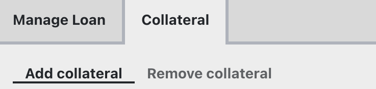{ width="400" }
  <figcaption></figcaption>
</figure>

#### Добавить залог (Add Collateral) {#add-collateral}

Добавьте больше залога к займу. *Это невозможно во время мягкой ликвидации. Если здоровье снижается, необходимо погасить часть долга вместо добавления залога*.

#### Удалить залог (Remove Collateral) {#remove-collateral}

Удалите залог из займа.

### **Вкладка Управления Займом (Manage Loan Tab)** {#manage-loan-tab}

*Вкладка `"Manage Loan"` имеет следующие опции:*

<figure markdown="span">
  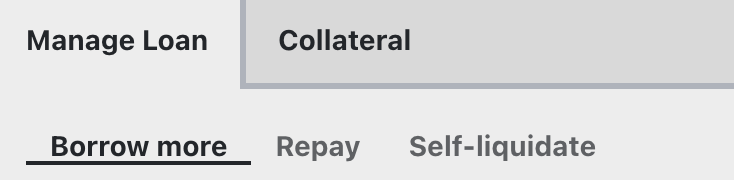{ width="400" }
  <figcaption></figcaption>
</figure>

#### **Дополнить Заимствование (Borrow More)** {#borrow-more}

Дополнительно заимствование позволяет пользователю занять больше долга и одновременно добавить больше залога.

#### **Погасить (Repay)** {#repay}

Погашение имеет следующие опции, и все опции позволяют пользователю **частично** или **полностью погасить** свои займы. Если погашение происходит частично, диапазон ликвидации будет изменен для пользователя.

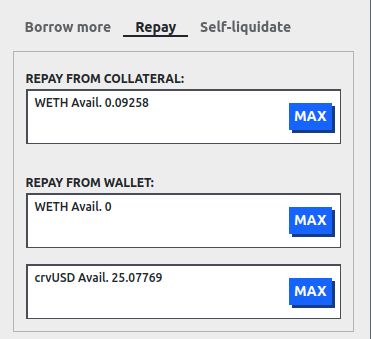{: .centered }

**Погасить из Залога (Repay From Collateral)** удаляет залог (например, WETH или crvUSD) из кредитного рынка, конвертирует их в токен долга, если необходимо (например, crvUSD), и возвращает любой остаток токена долга (например, crvUSD) пользователю, если займ полностью погашен и закрыт. *Обратите внимание, что это доступно только на новых рынках (рынках, которые поддерживают кредитное плечо, доступна эта функция). На старых рынках требуется погашение с использованием токена долга.*

**Погасить из кошелька (Repay from Wallet)** имеет два поля, одно для залогового актива, и одно для токена долга:

 * **Залоговый актив, например, WETH**: работает так же, как и **Погасить из Залога**, все отправленные WETH будут конвертированы в crvUSD, долг будет погашен и любые оставшиеся crvUSD будут возвращены пользователю, если займ полностью погашен и закрыт.
 
 * **Токен долга, например, crvUSD**: погашает долг с помощью отправленного crvUSD. Если весь долг погашен, займ закрывается, и весь залог на кредитном рынке возвращается пользователю, в приведенном выше случае пользователь получит обратно свои WETH.

#### **Самостоятельная Ликвидация (Self-liquidate)** {#self-liquidate}

Это позволяет пользователю ликвидировать свой займ до того, как его смогут жёстко ликвидировать. Пользователи, использующие эту функцию, скорее всего, уже находятся в режиме мягкой ликвидации. Это позволяет пользователю вернуть свой залог и предотвращает потерю суммы, определенной [`Liquidation Discount`](../crvusd/loan-concepts.md#market-parameters).

Рассмотрим пользователя по имени Алиса, которая изначально заняла 1000 crvUSD, используя 1 WETH в качестве залога, чтобы понять, как это работает. Алиса находится в режиме мягкой ликвидации, и ее здоровье снижается. В режиме мягкой ликвидации 0.2 WETH было конвертировано в 250 crvUSD, поэтому у нее теперь 0.8 WETH и 250 crvUSD, обеспечивающих ее займ на 1000 crvUSD. Алиса хочет самостоятельно ликвидировать свой займ. Алисе нужно отправить только 750 crvUSD для самостоятельной ликвидации, так как у нее уже есть 250 crvUSD залога. Эти суммы вместе погашают долг в 1000 crvUSD. Затем Алиса получает обратно свои 0.8 WETH.

---

## **Как Взять Займ с Кредитным Плечом (How to take out a leverage loan)** {#how-to-take-out-a-leverage-loan}

Все новые кредитные рынки позволяют пользователям использовать кредитное плечо. Например, рынок WBTC ниже позволяет использовать кредитное плечо до 11x при заимствовании с этого кредитного рынка. Кредитное плечо 11x означает, что 10x от депонированной суммы WBTC заимствуется в crvUSD и конвертируется в WBTC с использованием 1inch.

{: .centered }

!!!info "Информация"
    Если рынок не отображает значение в столбце кредитного плеча, то кредитное плечо все еще можно нарастить вручную, используя [циклическое кредитное плечо](./leverage.md#leverage-looping).

Кликните на желаемый рынок с кредитным плечом, затем перейдите на вкладку `leverage` рядом с вкладкой `create loan`, как показано здесь:

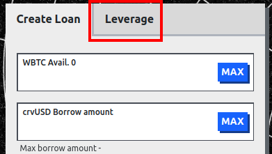{: .centered }

После перехода на вкладку `leverage` будут отображаться следующие опции:

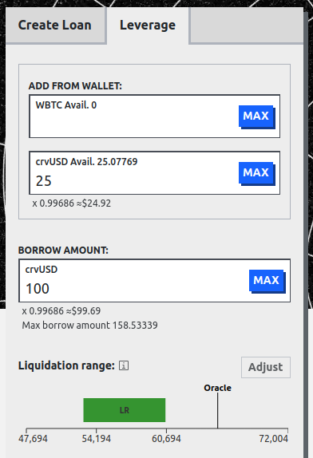{: .centered }

Это показывает всю информацию и опции для открытия займа с кредитным плечом. Обратите внимание, что `ADD FROM WALLET` позволяет добавлять оба актива в займ. На этом рынке пользователь может добавить WBTC, crvUSD или оба. См. информацию о [депонировании комбинации активов](./leverage.md#depositing-a-combination-of-assets) для понимания, как это работает.

**`BORROW AMOUNT`** позволяет пользователю указать, сколько он хотел бы занять.

Если [**`Advanced Mode` активирован**](#creating-a-new-loan), пользователь может нажать кнопку **`adjust`** рядом с диапазоном ликвидации. Это позволяет пользователю изменить количество полос `N` для своего диапазона ликвидации. Пример этого показан ниже с другими деталями займа:

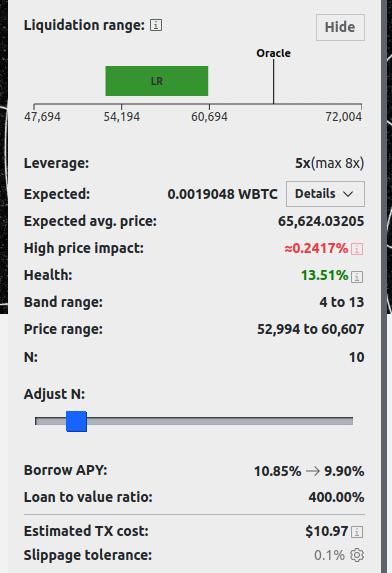{: .centered }

**`Leverage`** рассчитывается по следующей формуле:

$$ \text{Leverage} = \frac{\text{value deposited} + \text{value borrowed}}{\text{value deposited}}$$

Например, если \$10,000 crvUSD и \$10,000 WBTC депонированы (\$20,000 общей стоимости депонирования), и пользователь заимствует \$80,000 crvUSD, то кредитное плечо составляет 5x.

**`Expected`** и **`Expected avg. price`** связаны с тем, сколько WBTC ожидается получить после обмена заимствованного crvUSD и какова ожидаемая средняя цена обмена. **`Expected`** имеет сворачиваемые детали, которые показывают маршрут, по которому активы будут обмениваться. Эти **обмены всегда предоставляются 1inch**. Пример этих деталей приведен ниже и показывает, что 125 crvUSD будут обменены на 0.0019074 WBTC.

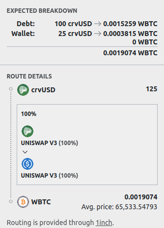{: .centered }

**`Price impact`** — это разница между ценой оракула и средней ценой обмена.

**`Band range`** — это начальные и конечные полосы ликвидации займа, например, "4 до 13" означает, что займ начнется в полосе 4 и закончится в полосе 13. **`Price range`** показывает `Band range` как ценовой диапазон, например, полосы 4 до 13 могут соответствовать ценовому диапазону 52,994 до 60,607. См. [здесь](../crvusd/loan-concepts.md#bands-n) для получения дополнительной информации о полосах.
    
**`Health`** показывает, насколько здоров займ, это значение должно быть положительным. Если оно меньше или равно 0, займ может быть жёстко ликвидирован. См. [здесь](../crvusd/loan-concepts.md#loan-health) для получения дополнительной информации о здоровье займа.

**`Borrow APY`** показывает процентную ставку до и после создания займа. **`Loan to Value Ratio`** показывает стоимость депонированного залога по сравнению с заимствованным залогом.

**`Estimated TX Cost`** показывает стоимость газа в USD. **`Slippage tolerance`** — это максимальное допустимое проскальзывание при обмене.

Перед взятием займа появится экран, показывающий детали займа, например: 

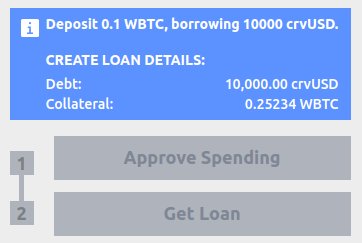{: .centered }

Затем токены, которые будут использованы в качестве залога, нужно одобрить, и затем займ может быть взят путем нажатия на **`Get Loan`** и отправки транзакции.

## **Закрытие Займа с Кредитным Плечом (Closing a leveraged loan)** {#closing-a-leveraged-loan}

Закрытие займа с кредитным плечом можно выполнить двумя способами: либо через [погашение](#repay), либо через [самостоятельную ликвидацию](#self-liquidate). Самым эффективным из этих вариантов является [погашение с залогом](#repay). Это удаляет весь залог, обменивает его на тот же токен долга, погашает долг и возвращает остаток пользователю. В противном случае долг необходимо полностью погасить для закрытия займа, и поскольку это займ с кредитным плечом, долг может быть выше, чем доступные у пользователя активы, что делает этот вариант непрактичным.

---

