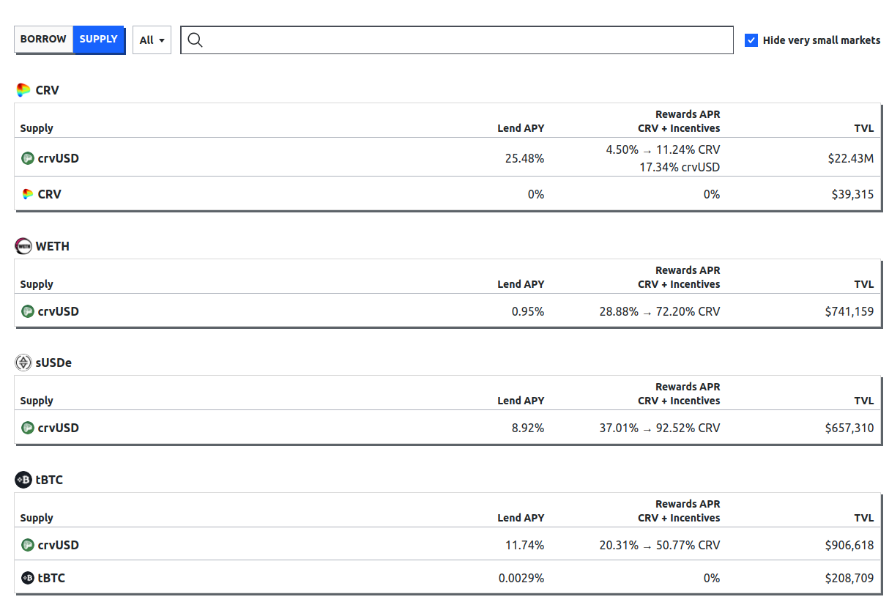
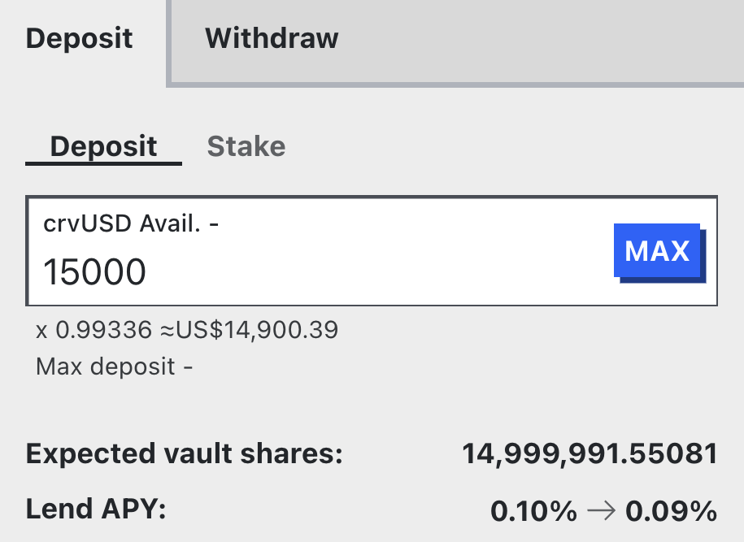
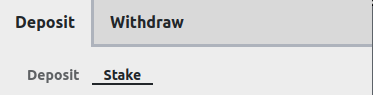
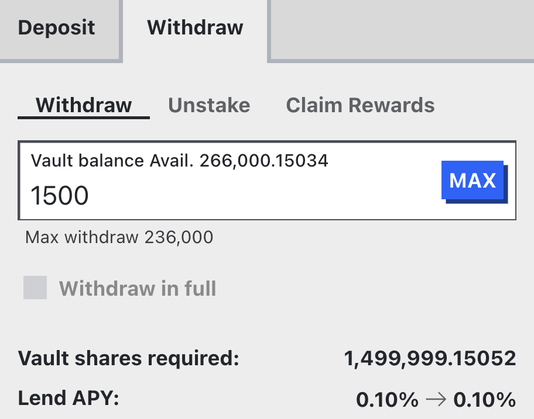
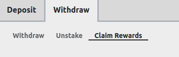
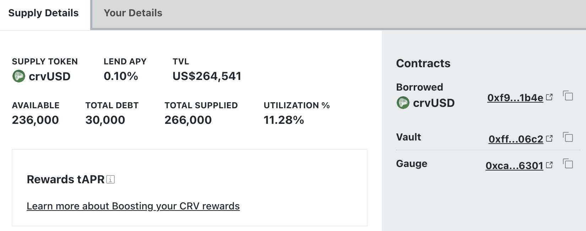

<h1>Как Предоставлять (Lend)</h1>

## **Интерфейс Предоставления (Supplying UI)** {#supplying-ui}

При выборе вкладки **`"SUPPLY"`** в [основном интерфейсе](https://lend.curve.fi/#/ethereum/markets), отображается вся соответствующая информация о рынках и показатели доходности для поставщиков ликвидности (lenders):
    
<figure markdown="span">
  { width="800" }
  <figcaption></figcaption>
</figure>
    
`Supply` показывает базовый токен хранилища, который можно предоставить. `Lend APY` — это текущая годовая процентная ставка за предоставление.
    
Кроме того, хранилища могут иметь счётчики вознаграждений (gauges), которые имеют право на получение эмиссий CRV после их добавления в GaugeController. Эти вознаграждения будут отображаться в столбце `Rewards APR / CRV + Incentives`, если они есть. См. [здесь](./overview.md#rewards-apr) для получения информации о том, что необходимо для получения CRV-вознаграждений.
    
`TVL` отображает общую стоимость, блокированную в хранилище.
    
---
    
## **Как Работают Хранилища Предоставления (Supply Vaults)?** {#how-do-supply-vaults-work}
    
Ликвидность для заемщиков предоставляется в **ERC-4626 хранилищах**. Для подробной документации о том, как они работают, пожалуйста, ознакомьтесь с официальной [документацией Ethereum](https://ethereum.org/de/developers/docs/standards/tokens/erc-4626/) или посетите [техническую документацию Curve](https://docs.curve.fi/lending/contracts/vault/).
    
Эти хранилища **приносят доход**, что означает, что **пользователю не нужно отдельно требовать** начисленные вознаграждения за кредитование своих активов[^1]. Доли выраженные в токеннах хранилища, которые пользователь получает за депонирование активов в хранилище, **увеличиваются в цене**, поскольку баланс базового актива растет благодаря динамике процентных ставок.
    
[^1]: Это не относится к вознаграждениям, начисляемым из liquidity gauges. Их нужно требовать во вкладке `"Withdraw" -> "Claim Rewards"`.
    
---
    
## **Депонирование Активов (Depositing Assets)** {#depositing-assets}
    
Для того чтобы предоставить токены в хранилище, пользователь должен **указать количество базовых токенов для добавления**. Базовыми токенами называются активы в хранилище, под которые производится заимствование.  
При депонировании интерфейс предварительно показывает количество долей, которые будут получены, и прогнозирует `Lend APY` после депонирования. Для депонирования нет ограничений. Пользователи могут депонировать столько, сколько хотят.
    
<figure markdown="span">
  { width="350" }
  <figcaption></figcaption>
</figure>
    
---
    
## **Стейкинг Активов (Staking Assets)** {#staking-assets}
    
После депонирования, при желании, пользователи могут застейкать свои доли хранилища в соответствующий gauge (если он есть) во вкладке **`"Stake"`**. Это позволяет пользователю получать `Rewards APR`, если они доступны. Нажмите на вкладку `Deposit` -> `Stake`, чтобы застейкать свои активы. Стейкинг долей хранилища означает отправку их в счётчик вознаграждений (Rewards Gauge), пользователь сохраняет владение, но они становятся непередаваемыми во время стейкинга. Стейкинг требует отдельной транзакции.
    
<figure markdown="span">
  { width="350" }
  <figcaption></figcaption>
</figure>
    
Liquidity gauges хранилищ могут быть добавлены в GaugeController для получения права на эмиссии CRV или внешние вознаграждения могут быть добавлены в gauge развертывателем.
    
---
    
## **Разстейкинг Активов (Unstaking Assets)** {#unstaking-assets}
    
Разстейкинг снимает ваши доли хранилища из Rewards Gauge и возвращает их на ваш адрес. Это требует транзакции для разстейкинга. Разстейкинг и требование вознаграждений могут быть выполнены вместе в одной транзакции. Это можно сделать во вкладке `Withdraw` -> `Unstake` интерфейса Предоставления для кредитного рынка, в который вы предоставляли средства.
    
<figure markdown="span">
  { width="350" }
  <figcaption></figcaption>
</figure>
    
Вы должны выполнить `Unstake` для своих долей хранилища перед тем, как сможете соврешить `Withdraw`.
    
---
    
## **Вывод Активов (Withdrawing Assets)** {#withdrawing-assets}
    
Если у пользователя уже есть доли, он может вывести желаемое количество базового актива во вкладке **`"Withdraw"`**. Также есть опция "Withdraw in full" (полный вывод), которая сжигает все доли пользователя и возвращает базовый актив[^2].
    
<figure markdown="span">
  { width="350" }
  <figcaption></figcaption>
</figure>
    
Интерфейс предварительно показывает количество долей, которые будут сожжены для получения базовых токенов. Если пользователь застейкал доли хранилища в счётчике вознаграждений (gauge), ему необходимо разстейкать их во вкладке **`"Unstake"`** перед тем, как сможет вывести.
    
[^2]: Этот метод будет работать только если хранилище имеет достаточно базовых активов для полного выкупа всех долей.
    
!!!tip "Ставки Кредитования при Депонировании или Выводе Активов"
    При депонировании базовых активов в хранилище, ставка кредитования может снизиться в зависимости от количества добавленных активов. Причина этого в том, что при предоставлении дополнительных активов уровень утилизации рынка снизится (так как теперь больше активов для заимствования), что одновременно снижает ставку заимствования. Когда ставка заимствования снижается, ставка кредитования также снижается.
    
    И наоборот: вывод активов из хранилища уменьшает общее количество активов. Это увеличивает уровень утилизации, что повышает ставку заимствования и, следовательно, ставку кредитования.  
        
    См. [здесь](./overview.md#utilization-lend-apy-and-borrow-apy) для получения дополнительной информации об утилизации и о том, как она влияет на ставки кредитования и заимствования.
    
---
    
## **Требование Вознаграждений (Claiming Rewards)** {#claiming-rewards}
    
Любые вознаграждения из **Rewards APR** будут доступны во вкладке `Withdraw` -> `Claim Rewards` здесь:
    
<figure markdown="span">
  { width="350" }
  <figcaption></figcaption>
</figure>
    
Требование вознаграждений требует транзакции, однако разстейкинг и требование вместе могут быть выполнены в одной транзакции.
    
---
    
*Активировав **`"Advanced Mode"`**, пользователь получает полный обзор хранилища.*
    
<figure markdown="span">
  { width="600" }
  <figcaption></figcaption>
</figure>
    
*Если у пользователя есть доли, он может просмотреть свою личную информацию хранилища во вкладке `"Your Details"`.*
    
<figure markdown="span">
  { width="600" }
  <figcaption></figcaption>
</figure>
    
---

