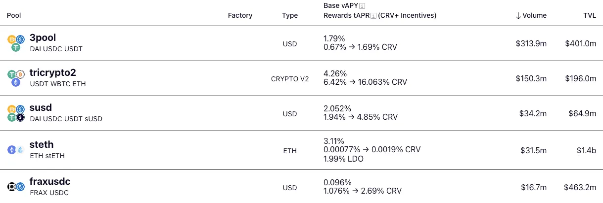
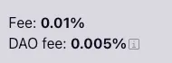
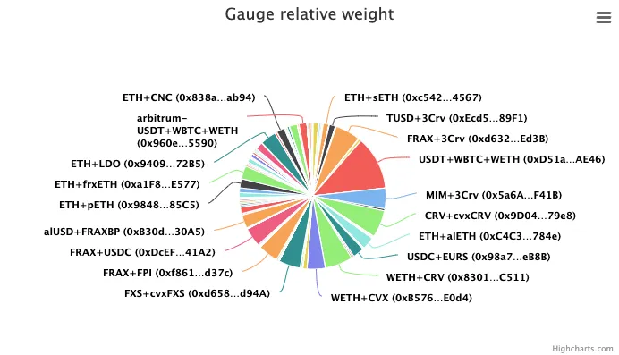
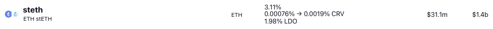
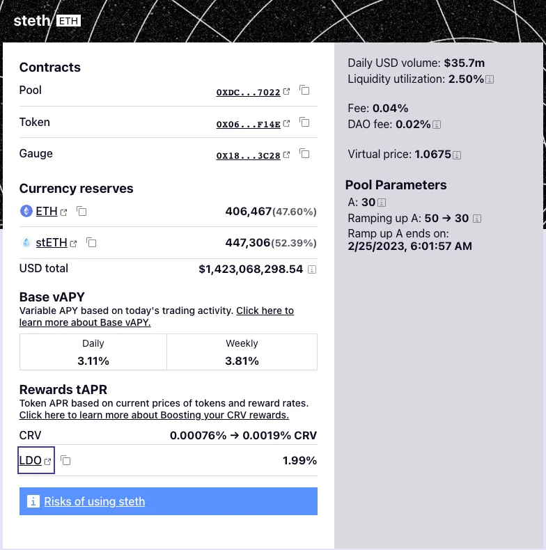

<h1>Расчет доходности</h1>

# **Объяснение того, как интерфейс Curve отображает расчеты доходности**

!!!warning "Предупреждение"
    **Эта страница устарела и скоро будет обновлена.** Многое из этой информации изменилось. Если вам нужна актуальная информация, пожалуйста, ознакомьтесь с [**новой технической документацией**](https://docs.curve.fi/) или спросите в [**Telegram Curve**](https://t.me/curvefi). Здесь есть ссылки на [**старую техническую документацию**](https://curve.readthedocs.io/), но документация там тоже устарела.

Как и вся документация в этом руководстве, эта статья предназначена для подробного, но не технического ознакомления, за исключением нескольких простых математических формул. Хотя мы выделяем конкретные названия функций смарт-контрактов, на которые может ссылаться интерфейс Curve для удобства, никаких знаний программирования не требуется для понимания этой статьи.

# **Типы Доходности** {#types-of-yield}

Интерфейс Curve, отображающий различные типы доходности Curve (tAPY и tAPR).

На приведенном выше скриншоте вы можете увидеть, что пул Curve имеет потенциал предлагать множество различных типов доходности. Документация предоставляет обзор различных типов доходности здесь:

[**Понимание CRV**](../crv-token/overview.md)

Важно помнить, что эти цифры являются прогнозами на основе исторической производительности пула. Пользователь получит эту ставку, если производительность пула останется точно такой же в течение одного года.

Эти типы доходности:

*   **Базовый vAPY:** Показан в первой строке, это число представляет комиссии, которые начисляются держателям LP-токенов на основе объема торгов. [Подробнее](https://resources.curve.fi/lp/understanding-curve-pools)
*   **$CRV Вознаграждения tAPR:** Показан во второй строке, tAPR вознаграждений представляет ставку эмиссии токенов $CRV, которую пользователь получил бы, если у пула есть gauge вознаграждений, и пользователь стейкает в этот gauge вознаграждений. Число указано в виде диапазона возможных вознаграждений, размер этого буста может варьироваться в зависимости от блокированного пользователем veCRV. [Подробнее](https://resources.curve.fi/reward-gauges/understanding-gauges)
*   **Вознаграждения tAPR за стимулы:** Некоторые пулы также выбирают раздавать вознаграждения в форме другого токена — это представлено в третьей строке, если применимо.

**`vAPY`** означает _«variable annual percentage yield»_ («переменная годовая процентная доходность»), это значение рассчитывает годовую оценку доходности от торговых комиссий на основе торговой активности за прошлый день, включая любой эффект сложного процента.

Вознаграждения **`tAPR`** означает _«token annual percentage rate»_ («годовая процентная ставка по токенам») — вознаграждения в токенах должны быть востребованы вручную и поэтому не капитализируются автоматически, поэтому «ставка» является более правильным термином.

## **Базовый vAPY** {#base-vapy}

Когда пулы Curve запускаются, им назначаются значения для праметров **`fee`** (общая комиссия, применяемая к сделкам) и **`admin_fee`** (процент этой комиссии, который идет в Curve DAO, в отличие от LP пула). Эти параметры можно напрямую просмотреть в смарт-контракте через соответствующие названия функций.

Эти комиссии отображаются на странице пула в интерфейсе Curve:

Эти параметры могут быть обновлены в будущем Curve DAO путем вызова метода **`commit_new_fee`**. Если комиссии находятся в процессе изменения, они доступны для чтения в смарт-контракте через методы **`future_fee`** и **`future_admin_fee`**.

Комиссии зарабатываются или взимаются каждый раз, когда пользователь взаимодействует с контрактом пула через транзакцию, которая может повлиять на балансы пула. Например, прямой вызов функции **`exchange`** перебалансирует пул, поэтому комиссия будет применяться. Если вы добавляете или удаляете ликвидность несбалансированным образом, это также изменит соотношения токенов внутри пула и, таким образом, такое действие подлежит комиссиям. Комиссии не взимаются, если пользователь добавляет монеты в сбалансированной пропорции или при аналогичном удалении.

Когда вы вызываете методы для предварительного просмотра того, сколько токенов вы можете получить при взаимодействии с пулом (например, **`get_dy`** или **`calc_token_amount`**), значения, которые они возвращают, обычно, но не всегда, включают все комиссии — расчеты в интерфейсе предназначены для внесения любых корректировок, где это необходимо, но обязательно спросите у службы поддержки, если у вас есть вопросы.

Теоретически, можно рассчитать базовый vAPY за любой период, вычисляя комиссии для каждой транзакции и суммируя по всему диапазону. Однако, интерфейс Curve использует более простую методологию для расчета базового vAPY, где **`t`** — это время в днях:

$$\left( \frac{\text{virtual_price}(t=0)}{\text{virtual_price}(t=-1)} \right)^{365} - 1$$

Другими словами, vAPY измеряет изменение _**«virtual price»**_ пула между сегодня и вчера, а затем пересчитывает этот показатель в годовой эквивалент. _**«Virtual price»**_ — это мера роста пула со временем, и она видна напрямую в интерфейсе.

Интерфейс получает это значение напрямую, вызывая метод **`get_virtual_price`** в контракте пула.

Каждый раз, когда происходит транзакция с комиссией, virtual price увеличивается. Таким образом, когда пул запускается с virtual price ровно 1, и в какой-то момент его virtual price пула становится 1.01, то держатель токенов LP увидит, что стоимость токена увеличилась на 1%.

$$\frac{1.01}{1.00} - 1 = 0.01 = 1\%$$

Virtual price 1.01 означает, что LP получит на 1% больше стоимости при выводе ликвидности. Аналогично, новые пользователи, добавляющие ликвидность, получат на 1% меньше LP-токенов при депозите.

Для пулов привязанных стейблкоинов virtual price может быть легко использован для расчета vAPY пула с момента его создания без необходимости дополнительных вычислений. Для пулов версии v2 нужно учитывать колебания стоимости базовых активов.

Для разработчиков представлена дополнительная информация о торговых комиссиях в технической документации:

*   [**О торговых комиссиях**](https://curve.readthedocs.io/factory-deployer.html?highlight=fees#trade-fees)
*   [**Запрос админских комиссий**](https://curve.readthedocs.io/factory-pools.html?highlight=fees#claiming-admin-fees)
*   [**Распределение комиссий**](https://curve.readthedocs.io/dao-fees.html?highlight=fees#fee-distribution)

## **CRV Вознаграждения tAPR** {#crv-rewards-tapr}

Curve DAO также позволяет некоторым пулам получать дополнительные награды от эмиссии токенов $CRV, как описано в разделе [**Понимание Gauges**](https://resources.curve.fi/reward-gauges/understanding-gauges) документации. Если у пула есть подходящий гейдж (gauge), то интерфейс отображает диапазон возможных значений tAPR, которые пользователи зарабатывают в настоящее время, с возможными изменениями в будущем.

Формула, используемая здесь для расчета вознаграждений tAPR:

$$tAPR = \frac{\text{crv_price} \times \text{inflation_rate} \times \text{relative_weight} \times 12614400}{\text{working_supply} \times \text{asset_price} \times \text{virtual_price}}$$

Эти параметры получены из различных источников данных, в основном ончейн:

*   **`crv_price:`** Текущая цена токена $CRV в долларах США. Это может быть экстраполировано из ончейн-данных, но интерфейс полагается на API CoinGecko для получения этого значения.
*   **`inflation_rate:`** Ставка инфляции токена $CRV, доступная из функции `rate` токена $CRV.
*   **`relative_weight:`** На основе еженедельного голосования, каждый gauge вознаграждений пула Curve имеет вес относительно всех других gauges Curve. Это значение можно вычислить, вызвав ту же функцию в [**контракте контроллера gauges**](https://curve.readthedocs.io/dao-gauges.html#the-gauge-controller) Curve.

[https://dao.curve.fi/](https://dao.curve.fi/)

*   **`working_supply:`** Доступен путем вызова той же функции в конкретном контракте gauge Curve для пула.
*   **`asset_price:`** Цена актива — например, если пул содержит только биткоин, используется текущая цена $BTC. Для пулов версии v2 это значение необходимо рассчитывать как среднее от стоимости конкретных активов внутри пула.
*   **`virtual_price:`** Показатель роста пула со временем, как описано выше.

Магическое число `12614400` — это количество секунд в году `(60 * 60 * 24 * 365 = 31536000)` умноженное на 0.4. В этом случае 0.4 связано с эффектом бустов (минимальный буст 1 / максимальный буст 2.5 = 0.4).

Как показано в интерфейсе, все значения tAPR отображаются в виде диапазона: базовая ставка слева от стрелки показывает значение, которое пользователь получит без буста, а значение справа от стрелки — максимальное значение, которое пользователь может получить с максимальным бустом, который в 2.5 раза выше минимального. Дополнительная информация о расчете бустов [**доступна здесь**](../reward-gauges/boosting-your-crv-rewards.md).

Для разработчиков приведены ссылки на техническую документацию:

*   [**О Liquidity Gauges**](https://curve.readthedocs.io/dao-gauges.html?highlight=gauge)
*   [**Gauge Controller**](https://curve.readthedocs.io/dao-gauges.html#the-gauge-controller)
*   [**Gauges для EVM Sidechains**](https://curve.readthedocs.io/dao-gauges-sidechain.html)
*   [**Gauge Proxy**](https://curve.readthedocs.io/dao-ownership.html?highlight=gauge#gaugeproxy)

## **tAPR Стимулов** {#incentives-tapr}

Все пулы могут без разрешения Curve DAO стримить награды в других токенах. Интерфейс отображает эти бонусные награды только при их наличии. В примере с пулом stETH, приведенном ниже, видно, что пул стримит токены $LDO в дополнение к наградам в $CRV.

[**Страница обзора пулов**](https://curve.fi/#/ethereum/pools)

[**Страница пула stETH**](https://curve.fi/#/ethereum/pools/steth/deposit)

Дополнительная информация об этих дополнительных стимулах доступна в документации для разработчиков.

