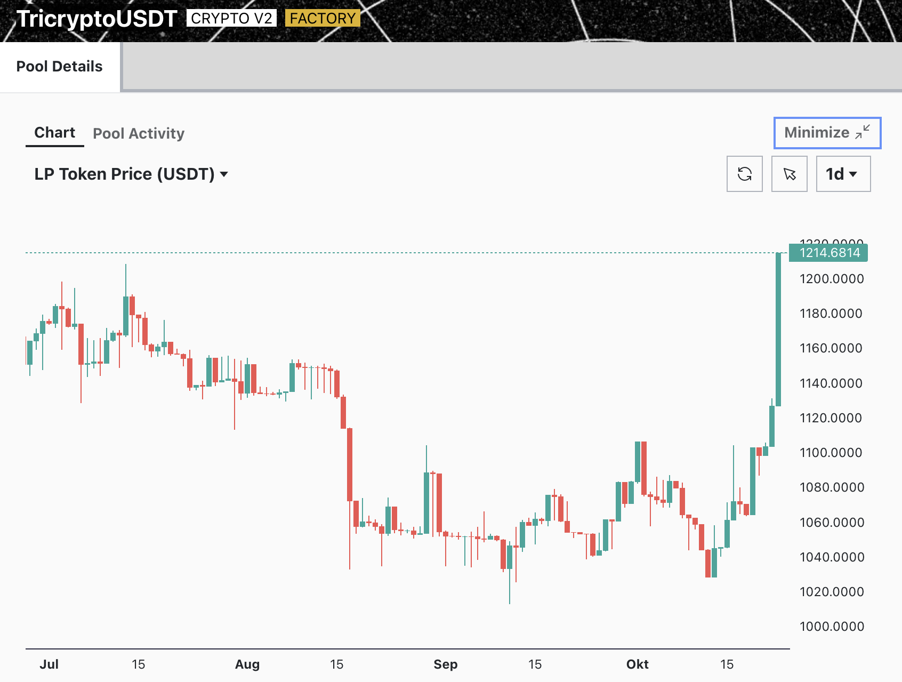
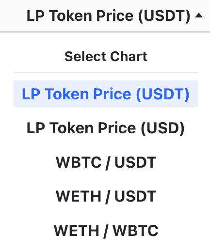
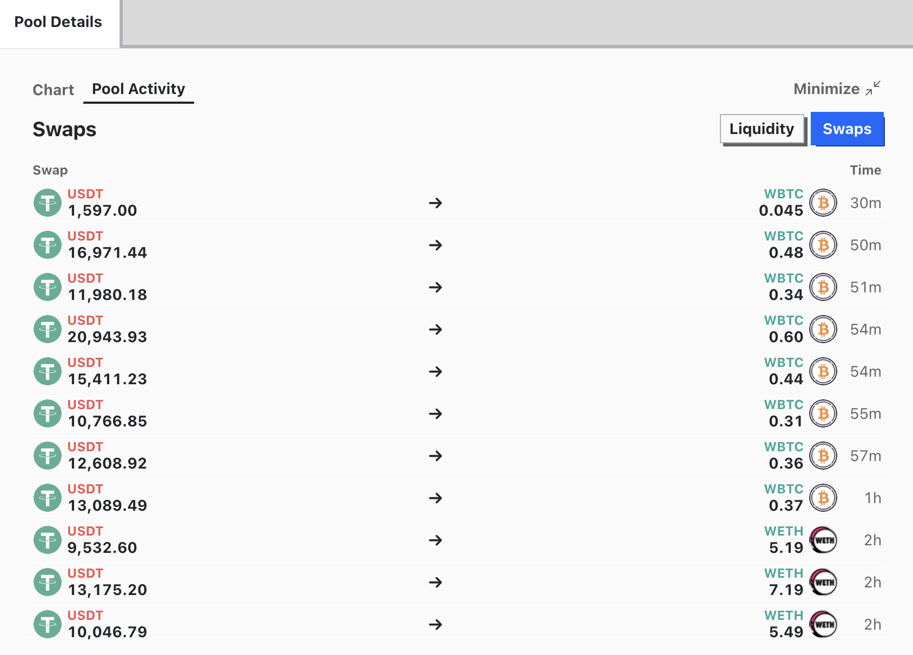

[Curve UI](https://curve.fi/) предлагает множество графиков, связанных с **ценами токенов**, а также **обзор истории обменов и активности ликвидности** (например, добавление или удаление ликвидности) для каждого пула.

## **Графики** {#charts}

LP токены — это токены, полученные при внесении активов в пул ликвидности. Эти токены представляют собой долю владения пользователя в пуле и могут быть обменяны на часть средств пула, включая любые начисленные комиссии. Их стоимость зависит от цен базовых активов в пуле ликвидности, подобно другим токенам.

Переход на вкладку **`Chart`** открывает графический интерфейсгде отображена цена токена LP, например, в отношении USDT. В правом верхнем углу доступны опции для разворачивания/сворачивания или обновления графика, а также настройки временного интервала.

<figure markdown>
  { width="600" }
  <figcaption></figcaption>
</figure>

Нажав на **`LP Token Price (USDT)`**, можно открыть выпадающее меню с дополнительными графиками.

<figure markdown>
  { width="150" }
  <figcaption></figcaption>
</figure>

## **Активность Пула** {#pool-activity}

Помимо графика цен, интерфейс также предоставляет обзор свопов (обменов) и действий с ликвидностью для пула на вкладке **`Pool Activity`**. 

Во вкладке **`Swaps`** интерфейс показывает токены, участвующие в обмене, и время каждой транзакции, указывая, сколько часов или минут назад она произошла. Нажатие на конкретный обмен перенаправит пользователя на транзакцию в Etherscan.

<figure markdown>
  { width="600" }
  <figcaption></figcaption>
</figure>

Перейдя на вкладку **`Liquidity`**, можно увидеть депозиты и снятия в пуле.

<figure markdown>
  { width="600" }
  <figcaption></figcaption>
</figure>

