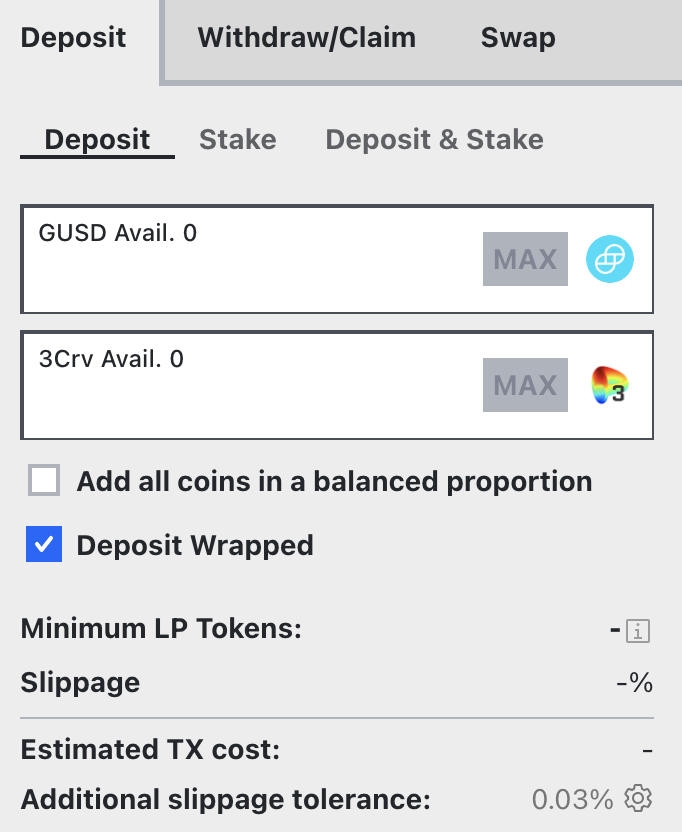
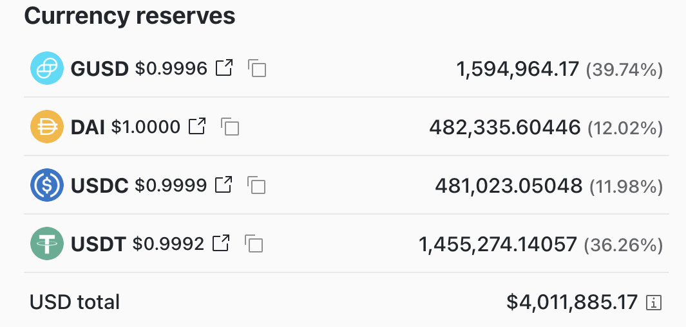
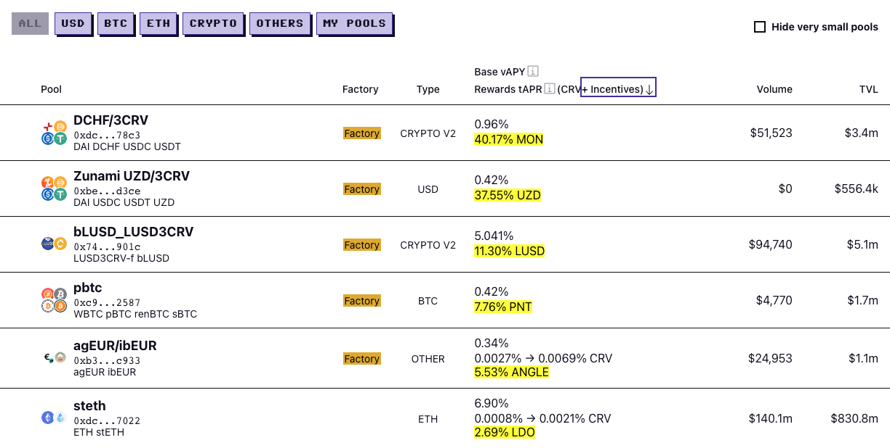

<h1>FAQ по Депозиту</h1>

## **Что такое опция «deposit wrapped»?** {#what-is-the-deposit-wrapped-option}

(Это относится к метапулам или пулам с c-токенами или a-токенами). Если вы вносите стейблкоин в один из пулов с кредитованием, Curve автоматически обернет ваш токен в `cToken` (для Compound) или `aToken` (для AAVE). Эта опция существует на случай, если вы ранее уже предоставили их в кредит на Compound или AAVE. Если ваш стейблкоин в его исходной форме, вы можете игнорировать эту опцию.

Если вы вносите средства в метапулы и у вас есть соответствующий токен базового пула (например, `3Crv`), вы также можете использовать опцию «deposit wrapped», чтобы внести этот токен.

<figure markdown>
  { width="300" }
  <figcaption></figcaption>
</figure>

## **Что происходит, когда вы предоставляете ликвидность в Curve?** {#what-happens-when-you-provide-liquidity-on-curve}

Когда вы переходите на страницу депозита и вносите один стейблкоин, он затем распределяется между каждым токеном в пуле. Это важно иметь в виду, потому что если вы внесете 1000 DAI в пул, как показано на скриншоте ниже, ваш баланс будет примерно равен 390,7 GUSD, 120 DAI, 119,8 USDC и 362,6 USDT. Эти значения постоянно меняются, поскольку люди торгуют и проводят арбитраж цен стейблкоинов.

<figure markdown>
  { width="300" }
  <figcaption></figcaption>
</figure>

## **Имеет ли значение, какую монету я вношу?** {#does-the-coin-i-deposit-matter}

Помимо бонуса за депозит, объясненного ниже, это не имеет значения. Ваши токены будут распределены в пуле, и это не повлияет на вашу доходность, поэтому вы можете вносить одну, несколько или все монеты в пул, не беспокоясь о влиянии на вашу доходность.

Однако здесь стоит уточнить важный момент. Если пул имеет низкую ликвидность или сумма вашего депозита значительна по сравнению с размером пула, внесение средств в одном токене может привести к тому, что ваши средства будут обменяны на другие токены пула по невыгодному курсу. Это связано с тем, что крупный депозит может нарушить баланс пула, вызывая проскальзывание и неблагоприятные обменные ставки.

В таких случаях рекомендуется предварительно обменять свои токены на открытом рынке таким образом, чтобы внести в пул все необходимые токены в пропорциях, соответствующих их долям в пуле. Это поможет минимизировать потери от неблагоприятных курсов обмена и обеспечить более эффективное использование ваших средств.

## **Понимание бонусов за депозит** {#understanding-deposit-bonuses}

На скриншоте выше вы можете увидеть, что GUSD довольно низкий, так как он должен составлять 50% от общего пула, потому что это метапул, спаренный с `3Crv`. Поэтому, если вы планировали присоединиться к GUSD-пулу, вам желательно внести GUSD в него.

Как вы можете увидеть на скриншоте, вы получите мгновенный бонус 0.0082% за внесение GUSD в пул.

Основная причина этого в том, что GUSD в настоящее время немного дороже, поэтому если вы пойдете на централизованную биржу, вы можете продать его за $1.007 вместо $1. Бонус за депозит отражает это.

Другая причина заключается в том, что пулы всегда стремятся уравновесить себя и вернуться к равным долям (в этом случае 50% GUSD), поэтому внесение монеты с наименьшей долей даст вам бонус за депозит.

<figure markdown>
  { width="300" }
  <figcaption></figcaption>
</figure>

## **Но означает ли это, что я все еще могу вывести в моем любимом стейблкоине?** {#but-does-that-mean-i-can-still-withdraw-in-my-favorite-stable-coin}

Когда вы выводите средства, применяется тот же принцип, что и в предыдущем вопросе, но в обратном порядке. Если вы выводите стейблкоин с наибольшей долей, вы получите бонус, но вы все еще выбираете, какой стейблкоин вы хотите вывести.

## **Насколько быстро начисляются/капитализируются проценты?** {#how-quickly-does-interest-accrue-compound}

Проценты для пулов, использующих кредитные протоколы, капитализируются каждый блок или каждые 15 секунд, или сразу после уплаты комиссий. Они также автоматически капитализируются.

## **Что такое арбитраж?** {#what-is-arbitrage}

Арбитраж — это одновременная покупка и продажа, в нашем случае, токена с целью получения прибыли. Поскольку криптовалютные рынки часто могут испытывать недостаток ликвидности, у трейдеров нередко возникают возможности воспользоваться ценовыми несоответствиями для получения прибыли, и этому могут способствовать такие протоколы, как Curve.

Пример транзакции: ​[**Etherscan**](https://etherscan.io/tx/0x259b7ac1f50554fe5ddcfeea7b4fa90ad70356ddfbbd341289db0dfbf99447f9)​

В этой транзакции кто-то использовал Curve и OasisDex и заработал около $200. Это возвращает нас к тому, что обсуждалось ранее с ликвидными пулами. Идея в том, чтобы стимулировать трейдеров использовать ценовые расхождения, от чего мы все получаем выгоду.

## **Что такое стимулируемые пулы?** {#what-are-incentivized-pools}

Пулы ликвидности, особенно те, участие в которых не требует от вас отказа от других выгодных возможностей (то есть без альтернативных издержек), являются отличным способом помочь стейблкоинам сохранять свою привязку к базовой стоимости. Это упрощает для трейдеров возможность заниматься арбитражем (см. вопрос выше), когда цена отклоняется от привязки. Это очень важно для всех компаний и фондов, разрабатывающих стейблкоины, поскольку стейблкоин по цене $0,98 выглядит не лучшим образом.

В результате некоторые пулы на Curve являются «стимулированными». Это означает, что помимо торговых комиссий и комиссий за заимствование, компании предоставляют дополнительные вознаграждения людям, которые предоставляют ликвидность в эти пулы своими монетами.

## **Что заставляет меняться APR по стимулам?** {#what-makes-the-incentives-apr-move}

Пул stETH на этом скриншоте зарабатывает еще 2.69% LDO в год, и есть три переменные, которые могут изменить это:

* Распределение LDO основано на количестве людей, стейкающих свои LP-токены, что означает, что ваша доля вознаграждений становится меньше, если больше людей начинают стейкать

* Цена LDO (рост цены LDO приведет к увеличению годового бонуса)

