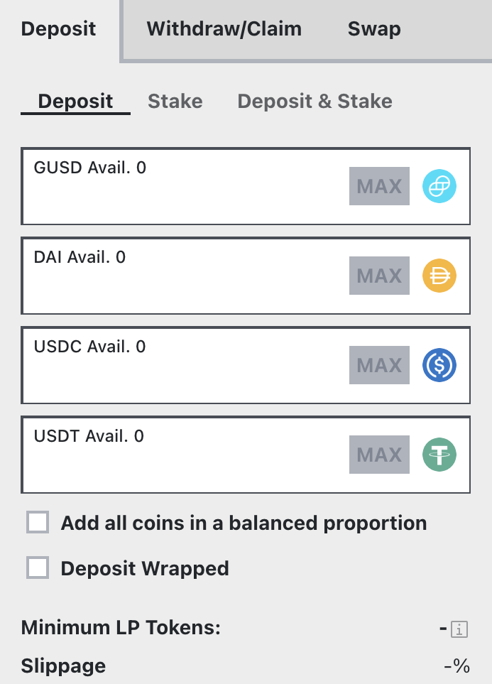
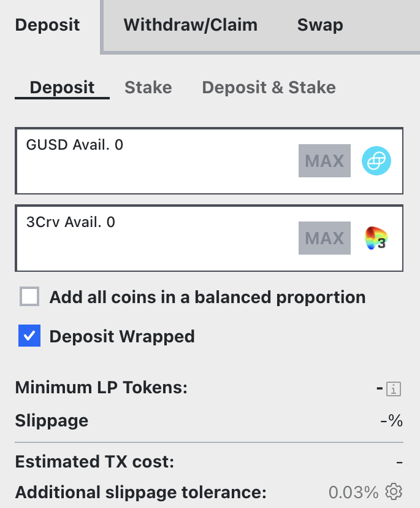

Metapools — это старая концепция в Curve Finance, которое позволяет одному токену быть объединенным с токенами в другом (базовом) пуле, не размывая его ликвидность. В настоящее время наиболее распространенным базовым пулом является 3Pool, который включает три самых ликвидных стабильных монеты (USDT-USDC-DAI).

## **Внесение средств** {#depositing}

Metapools предлагают несколько вариантов для внесения средств. Например, в Metapool [GUSD/3Pool](https://curve.fi/#/ethereum/pools/gusd/deposit) вы можете внести следующие активы:

*   GUSD
*   Любую из монет 3Pool (DAI-USDC-USDT)
*   LP токен 3Pool (3crv)

<figure markdown>
{ width="300" }
<figcaption></figcaption>
</figure>

Становясь поставщиком ликвидности, вам не обязательно вносить все монеты; вы можете внести одну или несколько монет в пул, и это не повлияет на вашу прибыль в пуле. Внесение монеты с наименьшей долей в пуле приведет к небольшому бонусу при депозите.

Во-вторых, как только вы вносите одну стабильную монету, **она будет распределена между тремя разными монетами в пуле, что означает, что теперь вы владеете ими всеми**. Первый флажок **`Add all coins in a balanced proportion`** (Добавить все монеты в сбалансированной пропорции) позволяет вам внести все три монеты в той же пропорции, в которой они находятся в пуле, что исключает возникновение проскальзывания.

Опция **`deposit wrapped`** позволяет внести токен базового пула (обычно 3Pool).

<figure markdown>
{ width="300" }
<figcaption></figcaption>
</figure>

Внося монеты в метапул и, таким образом, получая доступ к токену базового пула (например, 3CRV) и его парному токену, вы будете зарабатывать по ставке  метапула. Однако вы также будете получать торговые комиссии как от базового пула, так и от метапула.

## **Подтверждение и стейкинг** {#confirming-and-staking}

Вам будет предложено одобрить контракт Curve Finance, после чего следует транзакция депозита, которая упакует ваши стейблкоины и внесет их в пул.

После внесения средств в пул вы получаете токены провайдера ликвидности (LP-токены). Они представляют вашу долю владения в пуле, и они понадобятся вам для стейкинга в гейдже (для получения эмиссии CRV, стимулов и поинтов).

Если у вас уже есть LP-токены, вы можете непосредственно застейкать их в гейдже через вкладку **`Stake`** для получения эмиссии CRV, стимулов и поинтов. В противном случае токены просто останутся в пуле зарабатывая доход только с комиссий за обмены.

Через вкладку **`Deposit and stake`** вы можете сделать два предыдущих действия в одну транзакцию. 

**После предоставления ликвидности и стейкинга доступные комиссии, стимулы, CRV и поинты начнут начислятся сразу.**

*Вы можете перейти по ссылке ниже, чтобы узнать, как увеличить свои награды CRV, блокировав CRV в Curve DAO:*

- [Увеличение ваших наград CRV](../../reward-gauges/boosting-your-crv-rewards.md)
- [Стейкинг вашего $CRV](../../vecrv/locking-your-crv.md)

