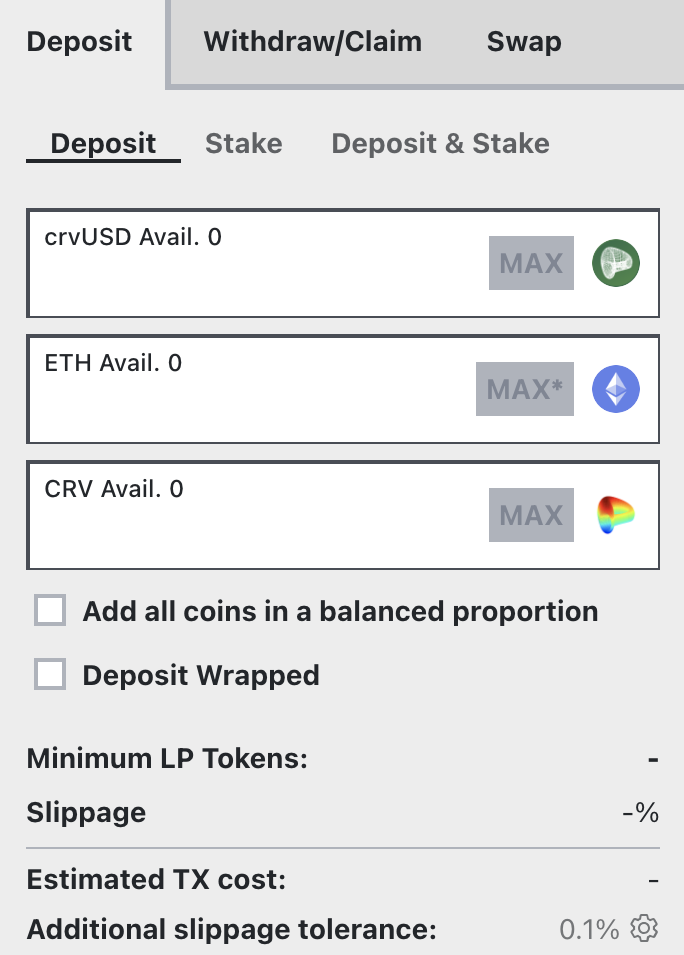

Tricrypto пулы содержат три волатильных актива.

[Узнайте больше о пулах версии v2](../../base-features/understanding-crypto-pools.md)

*Например, [пул TriCRV](https://curve.fi/#/ethereum/pools/factory-tricrypto-4/deposit) используется в примерах ниже.*

## **Внесение средств в пул** {#depositing-into-the-pool}

Посетите страницу депозита ([https://curve.fi/#/ethereum/pools/factory-tricrypto-4/deposit](https://curve.fi/#/ethereum/pools/factory-tricrypto-4/deposit)). Вам потребуется как минимум один из трех токенов в пуле для внесения. Пул TriCRV состоит из CRV, crvUSD и ETH.

<figure markdown>
  { width="300" }
  <figcaption></figcaption>
</figure>

Во-первых, важно понимать, что вам не нужно вносить все монеты, вы можете внести одну или несколько из них, и это не повлияет на вашу прибыль в пуле. Внесение монеты с наименьшей долей в пуле приведет к небольшому бонусу при депозите.

Во-вторых, как только вы вносите одну стабильную монету, **она будет распределена между тремя разными монетами в пуле, что означает, что теперь вы владеете ими всеми**. Первый флажок **`Add all coins in a balanced proportion`** (Добавить все монеты в сбалансированной пропорции) позволяет вам внести все три монеты в той же пропорции, в которой они находятся в пуле, что исключает возникновение проскальзывания.

Второй флажок **`Deposit Wrapped`** позволяет пользователям вносить обернутый ETH (wETH) вместо обычного ETH.

## **Подтверждение и стейкинг** {#confirming-and-staking}

Вам будет предложено одобрить контракт Curve Finance, после чего следует транзакция депозита, которая упакует ваши стейблкоины и внесет их в пул.

После внесения средств в пул вы получаете токены провайдера ликвидности (LP-токены). Они представляют вашу долю владения в пуле, и они понадобятся вам для стейкинга в гейдже (для получения эмиссии CRV, стимулов и поинтов).

Если у вас уже есть LP-токены, вы можете непосредственно застейкать их в гейдже через вкладку **`Stake`** для получения эмиссии CRV, стимулов и поинтов. В противном случае токены просто останутся в пуле зарабатывая доход только с комиссий за обмены.

Через вкладку **`Deposit and stake`** вы можете сделать два предыдущих действия в одну транзакцию. 

**После предоставления ликвидности и стейкинга доступные комиссии, стимулы, CRV и поинты начнут начислятся сразу.**

*Вы можете перейти по ссылке ниже, чтобы узнать, как увеличить свои награды CRV, блокировав CRV в Curve DAO:*

- [Увеличение ваших наград CRV](../../reward-gauges/boosting-your-crv-rewards.md)
- [Стейкинг вашего $CRV](../../vecrv/locking-your-crv.md)

