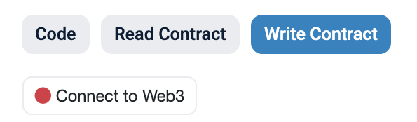
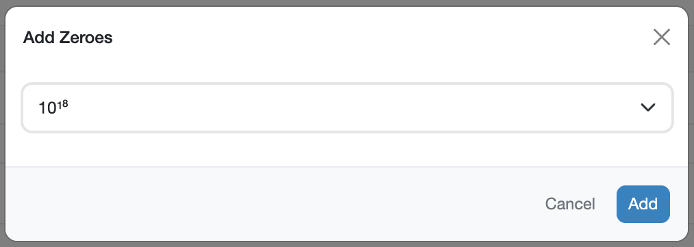
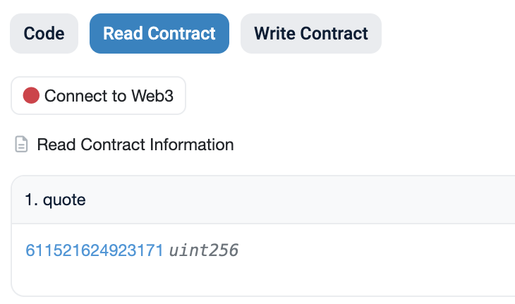
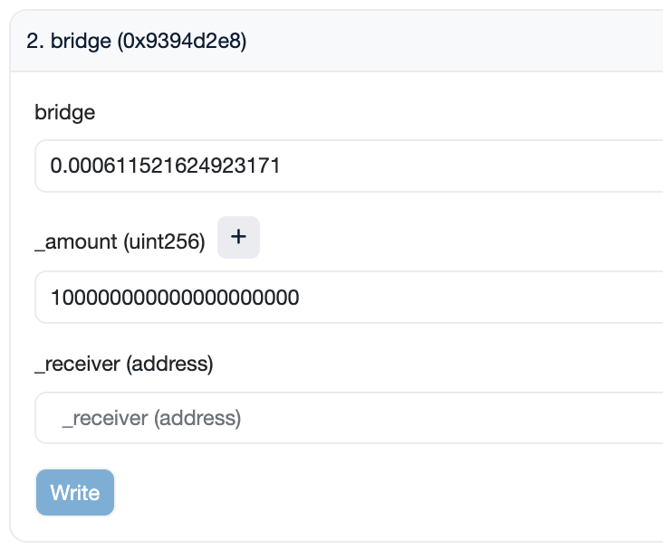
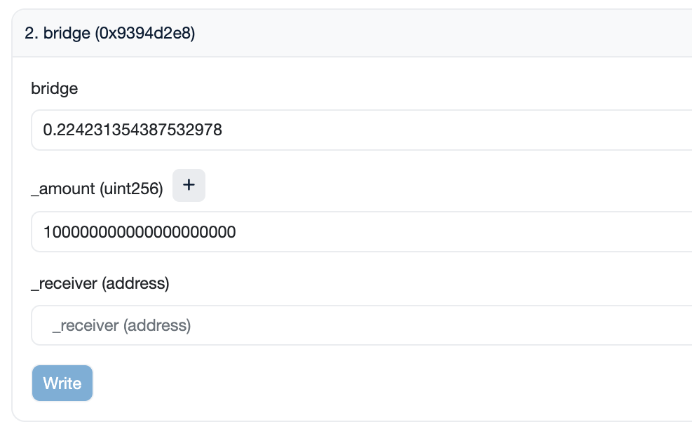

<h1>Руководство пользователя: Бриджинг токенов экосистемы Curve</h1>

Curve использует [LayerZero](https://layerzero.network/) для обеспечения **кроссчейновых переводов (Бриджинг) `CRV`, `crvUSD` и `scrvUSD`** на другие блокчейны уровня L1, такие как `BinanceSmartChain`, `Avalanche` и `Fantom`. Однако в этом руководстве основное внимание уделяется бриджингу с использованием только блокчейн-обозревателей, что снижает зависимость от сторонних интерфейсов и избегает любых дополнительных комиссий, которые они могут взимать.

Это руководство объясняет, как **бриджить любой из трех токенов из основной сети Ethereum на другие блокчейны уровня L1 или наоборот**. Единственные требования включают наличие кошелька с токеном, который нужно бриджить, и ETH или газового токена L1, в зависимости от направления бриджинга, для покрытия транзакционных комиссий.

!!!info "Адреса контрактов"
    Это руководство применимо для бриджинга `CRV`, `crvUSD` и `scrvUSD` на другие блокчейны уровня L1. При следовании этому руководству необходимо убедиться, что используются правильные адреса контрактов в зависимости от токена, который нужно бриджить.

    === ":logos-crv: CRV"

        Адреса контрактов для бриджей являются зеркальными, что означает, что контракт бриджа на Ethereum такой же, как и на блокчейне L1. Но адрес токена CRV отличается для каждой цепочки.

        - :logos-ethereum: Ethereum: [`0xD533a949740bb3306d119CC777fa900bA034cd52`](https://etherscan.io/address/0xD533a949740bb3306d119CC777fa900bA034cd52)
        - :logos-bsc: Binance Smart Chain: [`0x9996D0276612d23b35f90C51EE935520B3d7355B`](https://bscscan.com/address/0x9996D0276612d23b35f90C51EE935520B3d7355B)
        - :logos-avalanche: Avalanche: [`0xEEbC562d445F4bC13aC75c8caABb438DFae42A1B`](https://snowscan.xyz/address/0xEEbC562d445F4bC13aC75c8caABb438DFae42A1B)
        - :logos-fantom: Fantom: [`0xE6c259bc0FCE25b71fE95A00361D3878E16232C3`](https://ftmscan.com/address/0xE6c259bc0FCE25b71fE95A00361D3878E16232C3)

        | Сеть | Адрес контракта бриджа | Ссылка на Etherscan |
        | ------------------ | ---------------- | ---------------- |
        | :logos-bsc: BinanceSmartChain Bridge | `0xC91113B4Dd89dd20FDEECDAC82477Bc99A840355` | [Ethereum](https://etherscan.io/address/0xC91113B4Dd89dd20FDEECDAC82477Bc99A840355), [BSC](https://bscscan.com/address/0xC91113B4Dd89dd20FDEECDAC82477Bc99A840355) |
        | :logos-avalanche: Avalanche Bridge | `0x5cc0144A511807608eF644c9e99B486124D1cFd6` | [Ethereum](https://etherscan.io/address/0x5cc0144A511807608eF644c9e99B486124D1cFd6), [Avalanche](https://snowscan.xyz/address/0x5cc0144A511807608eF644c9e99B486124D1cFd6) |
        | :logos-fantom: Fantom Bridge | `0x7ce8aF75A9180B602445bE230860DDcb4cAc3E42` | [Ethereum](https://etherscan.io/address/0x7ce8aF75A9180B602445bE230860DDcb4cAc3E42), [Fantom](https://ftmscan.com/address/0x7ce8aF75A9180B602445bE230860DDcb4cAc3E42) |

    === ":logos-crvusd: crvUSD"

        Адреса контрактов для бриджей являются зеркальными, что означает, что контракт бриджа на Ethereum такой же, как и на блокчейне L1. Но адрес токена crvUSD отличается для каждой цепочки.

        - :logos-ethereum: Ethereum: [`0xf939E0A03FB07F59A73314E73794Be0E57ac1b4E`](https://etherscan.io/address/0xf939E0A03FB07F59A73314E73794Be0E57ac1b4E)
        - :logos-bsc: Binance Smart Chain: [`0xe2fb3F1271dB1C41564BD01ef6b1a75fC1db4d4f`](https://bscscan.com/address/0xe2fb3F1271dB1C41564BD01ef6b1a75fC1db4d4f)
        - :logos-avalanche: Avalanche: [`0xCb7c161602d04C4e8aF1832046EE08AAF96d855D`](https://snowscan.xyz/address/0xCb7c161602d04C4e8aF1832046EE08AAF96d855D)
        - :logos-fantom: Fantom: [`0xD823D2a2B5AF77835e972A0D5B77f5F5A9a003A6`](https://ftmscan.com/address/0xD823D2a2B5AF77835e972A0D5B77f5F5A9a003A6)

        | Сеть | Адрес токена crvUSD | Ссылка на Etherscan |
        | ------------------ | ---------------- | ---------------- |
        | :logos-bsc: BinanceSmartChain Bridge | `0x0A92Fd5271dB1C41564BD01ef6b1a75fC1db4d4f` | [Ethereum](https://etherscan.io/address/0x0A92Fd5271dB1C41564BD01ef6b1a75fC1db4d4f), [BSC](https://bscscan.com/address/0x0A92Fd5271dB1C41564BD01ef6b1a75fC1db4d4f) |
        | :logos-avalanche: Avalanche Bridge | `0x26D01ce989037befd7Ff63837A86e2da32E7D7e2` | [Ethereum](https://etherscan.io/address/0x26D01ce989037befd7Ff63837A86e2da32E7D7e2), [Avalanche](https://snowscan.xyz/address/0x26D01ce989037befd7Ff63837A86e2da32E7D7e2) |
        | :logos-fantom: Fantom Bridge | `0x76EAfda658C54548B460B3f190386699DE3827d8` | [Ethereum](https://etherscan.io/address/0x76EAfda658C54548B460B3f190386699DE3827d8), [Fantom](https://ftmscan.com/address/0x76EAfda658C54548B460B3f190386699DE3827d8) |

    === ":logos-scrvusd: scrvUSD"

        Адреса контрактов для бриджей являются зеркальными, что означает, что контракт бриджа на Ethereum такой же, как и на блокчейне L1. Но адрес токена scrvUSD отличается для каждой цепочки.

        - :logos-ethereum: Ethereum: [`0x0655977FEb2f289A4aB78af67BAB0d17aAb84367`](https://etherscan.io/address/0x0655977FEb2f289A4aB78af67BAB0d17aAb84367)
        - :logos-bsc: Binance Smart Chain: [`0x0094Ad026643994c8fB2136ec912D508B15fe0E5`](https://bscscan.com/address/0x0094Ad026643994c8fB2136ec912D508B15fe0E5)
        - :logos-avalanche: Avalanche: [`0xA3ea433509F7941df3e33857D9c9f212Ad4A4e64`](https://snowscan.xyz/address/0xA3ea433509F7941df3e33857D9c9f212Ad4A4e64)
        - :logos-fantom: Fantom: [`0x5191946500e75f0A74476F146dF7d386e52961d9`](https://ftmscan.com/address/0x5191946500e75f0A74476F146dF7d386e52961d9)

        | Сеть | Адрес контракта бриджа | Ссылка на Etherscan |
        | ------------------ | ---------------- | ---------------- |
        | :logos-bsc: BinanceSmartChain Bridge | `0xAE0666C978500f2C05784242B79B08C478Dd999c` | [Ethereum](https://etherscan.io/address/0xAE0666C978500f2C05784242B79B08C478Dd999c), [BSC](https://bscscan.com/address/0xAE0666C978500f2C05784242B79B08C478Dd999c) |
        | :logos-avalanche: Avalanche Bridge | `0x26E91B1f142b9bF0bB37e82959bA79D2Aa6b99b8` | [Ethereum](https://etherscan.io/address/0x26E91B1f142b9bF0bB37e82959bA79D2Aa6b99b8), [Avalanche](https://snowscan.xyz/address/0x26E91B1f142b9bF0bB37e82959bA79D2Aa6b99b8) |
        | :logos-fantom: Fantom Bridge| `0x08132eA9b02750E118cF5F5C640B7c46A8E638E8` | [Ethereum](https://etherscan.io/address/0x08132eA9b02750E118cF5F5C640B7c46A8E638E8), [Fantom](https://ftmscan.com/address/0x08132eA9b02750E118cF5F5C640B7c46A8E638E8) |

---

## **Бриджинг токенов с Ethereum на блокчейн L1** {#bridging-tokens-from-ethereum-to-an-l1-blockchain}

### Шаг 1: Одобрение контракта бриджа на использование ваших токенов {#step-1-approve-the-bridge-contract-to-spend-your-tokens}

1. Перейдите к контракту токена, который вы хотите бриджить, на [Etherscan](https://etherscan.io/).

2. Подключите свой кошелек, перейдя в раздел **`Contract` > `Write Contract`** и нажав **`Connect to Web3`**.

    <figure markdown="span">
    { width="300" }
    <figcaption></figcaption>
    </figure>

3. Найдите метод **`approve`** и одобрите соответствующий контракт бриджа как спендер.

    <figure markdown="span">
        { width="350" }
        <figcaption></figcaption>
    </figure>

    - **`_spender`**: Введите `0x0A92Fd5271dB1C41564BD01ef6b1a75fC1db4d4f`, адрес контракта бриджа. Этот адрес одинаков для всех токенов.
    - **`_value`**: Укажите сумму в формате 1e18 (например, для 100 crvUSD введите `100000000000000000000`).

    Чтобы избежать ручного ввода суммы в формате 1e18, вы можете ввести количество токенов, которые хотите бриджить, а затем добавить 18 нулей, используя кнопку **`+`**.

    <figure markdown="span">
        { width="350" }
        <figcaption></figcaption>
    </figure>

4. Нажмите **`Write`**. Транзакция должна появиться в вашем кошельке, которую нужно подписать для завершения одобрения.

---

### Шаг 2: Чтение контракта и получение котировки суммы ETH {#step-2-read-contract-and-quote-eth-amount}

1. Посетите контракт бриджа на Etherscan. Адрес этого контракта отличается в зависимости от токена, который нужно бриджить, и куда его бриджат. На этот раз **не нужно подключать свой кошелек**.

2. Используйте функцию **`1. quote`**, чтобы определить стоимость бриджинга.

    <figure markdown="span">
        { width="350" }
        <figcaption></figcaption>
    </figure>

    Сумма `quote` представляет собой стоимость (в ETH) вызова метода бриджа на [следующем шаге](#step-3-bridge-the-token-to-the-l1-blockchain). Это не включает расходы на газ, которые нужно оплатить дополнительно к указанной сумме.

---

### Шаг 3: Бриджинг токена на блокчейн L1 {#step-3-bridge-the-token-to-the-l1-blockchain}

1. Доступ к контракту бриджа на Etherscan. Адрес этого контракта отличается в зависимости от токена, который нужно бриджить, и куда его бриджат.

2. Подключите свой кошелек, перейдя в раздел **`Contract` > `Write Contract`** и нажав **`Connect to Web3`**.

    <figure markdown="span">
        { width="300" }
        <figcaption></figcaption>
    </figure>

3. Перейдите к методу **`2. bridge`** и введите свои значения. В этом контракте может быть несколько методов с одним и тем же именем. Убедитесь, что выбрали тот, который выглядит как на изображении ниже (он должен иметь три входных параметра: `bridge`, `_amount` и `_receiver`).

    <figure markdown="span">
        { width="400" }
        <figcaption></figcaption>
    </figure>

    - **`bridge`**: Введите сумму ETH, полученную на [Шаге 2](#step-2-read-contract-and-quote-eth-amount). Убедитесь, что вводите **сумму, выраженную в Ether** (сумма котировки / 1e18).
    - **`_amount`**: Укажите количество токенов для бриджинга в формате 1e18.
    - **`_receiver`**: Введите адрес кошелька, на который хотите получить токены.

    Чтобы избежать ручного ввода суммы в формате 1e18, вы можете ввести количество токенов, которые хотите бриджить, а затем добавить 18 нулей, используя кнопку **`+`**.

    <figure markdown="span">
        { width="350" }
        <figcaption></figcaption>
    </figure>

4. Нажмите **`Write`**. Транзакция должна появиться в вашем кошельке, которую нужно подписать для завершения процесса бриджинга.

!!!warning "Предупреждение"
    Транзакция бриджинга не будет обработана немедленно. После выполнения этих шагов может пройти несколько минут, прежде чем ваши токены успешно будут перемещены на L1.

---

## **Бриджинг токенов с блокчейна L1 на Ethereum** {#bridging-tokens-from-an-l1-blockchain-to-ethereum}

### Шаг 1: Одобрение контракта бриджа на использование ваших токенов {#step-1-approve-the-bridge-contract-to-spend-your-tokens}

1. Перейдите к контракту токена в блокчейн-обозревателе сети L1, с которой вы хотите бриджить. Например, чтобы бриджить crvUSD с BSC на Ethereum, вам нужно перейти к контракту токена crvUSD на BSCScan. Все адреса токенов перечислены в таблице в верхней части страницы.

2. Подключите свой кошелек, перейдя в раздел **`Contract` > `Write Contract`** и нажав **`Connect to Web3`**.

    <figure markdown="span">
        { width="300" }
        <figcaption></figcaption>
    </figure>

3. Найдите метод **`approve`** и одобрите соответствующий контракт бриджа как спендер.

    <figure markdown="span">
        { width="350" }
        <figcaption></figcaption>
    </figure>

    - **`_spender`**: Введите адрес контракта бриджа в блокчейне L1.
    - **`_value`**: Укажите сумму в формате 1e18 (например, для 100 crvUSD введите `100000000000000000000`).

    Чтобы избежать ручного ввода суммы в формате 1e18, вы можете ввести количество токенов, которые хотите бриджить, а затем добавить 18 нулей, используя кнопку **`+`**.

    <figure markdown="span">
        { width="350" }
        <figcaption></figcaption>
    </figure>

4. Нажмите **`Write`**. Транзакция должна появиться в вашем кошельке, которую нужно подписать для завершения одобрения.

---

### Шаг 2: Чтение контракта и получение котировки суммы комиссии {#step-2-read-contract-and-quote-the-fee-amount}

1. Посетите контракт бриджа на блокчейне L1, с которого вы хотите бриджить.

2. Используйте функцию **`1. quote`**, чтобы определить стоимость бриджинга.

    <figure markdown="span">
        { width="350" }
        <figcaption></figcaption>
    </figure>

    Сумма `quote` представляет собой стоимость (в газовом токене блокчейна L1) вызова метода бриджа на [Шаге 3](#step-3-bridge-tokens-to-ethereum). Это не включает расходы на газ, которые нужно оплатить дополнительно.

---

### Шаг 3: Бриджинг токенов на Ethereum {#step-3-bridge-tokens-to-ethereum}

1. Доступ к контракту бриджа на блокчейне L1, с которого вы хотите бриджить.

2. Подключите свой кошелек, перейдя в раздел **`Contract` > `Write Contract`** и нажав **`Connect to Web3`**.

    <figure markdown="span">
        { width="300" }
        <figcaption></figcaption>
    </figure>

3. Перейдите к методу **`2. bridge`** и введите свои значения. В этом контракте может быть несколько методов с одним и тем же именем. Убедитесь, что выбрали тот, который выглядит как на изображении ниже (он должен иметь три входных параметра: `bridge`, `_amount` и `_receiver`).

    <figure markdown="span">
        { width="400" }
        <figcaption></figcaption>
    </figure>

    - **`bridge`**: Введите сумму ETH, полученную на [Шаге 2](#step-2-read-contract-and-quote-the-fee-amount). Убедитесь, что вводите **сумму, выраженную в Ether** (сумма котировки / 1e18).
    - **`_amount`**: Укажите количество токенов в формате 1e18.
    - **`_receiver`**: Введите адрес кошелька, на который хотите получить токены.

    Чтобы избежать ручного ввода суммы в формате 1e18, вы можете ввести количество токенов, которые хотите бриджить, а затем добавить 18 нулей, используя кнопку **`+`**.

    <figure markdown="span">
        { width="350" }
        <figcaption></figcaption>
    </figure>

4. Нажмите **`Write`**. Транзакция должна появиться в вашем кошельке, которую нужно подписать для завершения процесса бриджинга.

!!!warning "Предупреждение"
    Транзакция бриджинга не будет обработана немедленно. После выполнения этих шагов может пройти несколько минут, прежде чем ваши токены успешно будут перемещены на L1.

