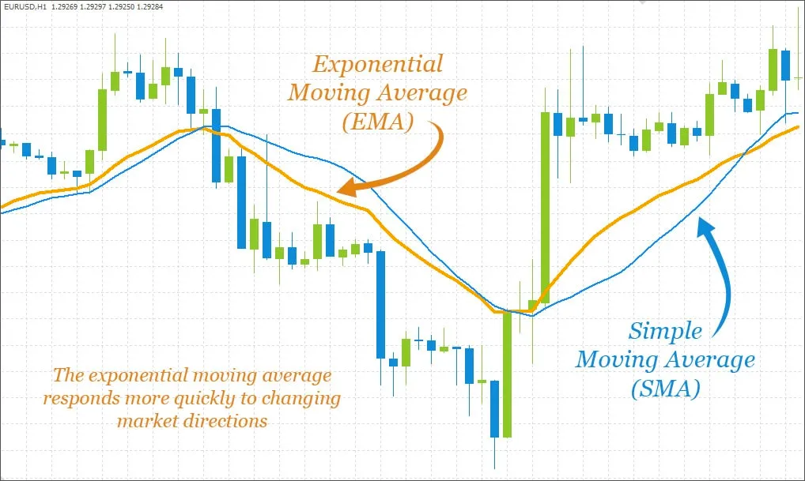

Этот документ в первую очередь рассматривает роль внутренних “price oracles” (ценовых оракулов) в пулах Curve Finance CryptoSwap, с кратким упоминанием в конце о [**LLAMMA price oracles**](../pool-creation/understanding-oracles.md#llamma).

Обратите внимание, что пулы Curve Stableswap и Cryptoswap не полагаются на внешние ценовые оракулы. **Неправильное использование внешних оракулов стало причиной нескольких крупных взломов в DeFi.** Если вы планируете использовать функции “price oracle” Curve или любой другой ценовой оракул для предоставления ончейн данных о ценах в децентрализованном приложении, которое вы разрабатываете, мы рекомендуем проявлять крайнюю осторожность.

### **Цель** {#purpose}

​[**Cryptoswap pools**](../pools/overview.md), состоящие из активов с волатильными ценами, требуют средства отслеживания цен. Вместо того чтобы полагаться на внешние оракулы, пул рассчитывает цену этих активов внутренне на основе торговой активности в пуле.

Это отслеживается двумя похожими, но разными параметрами:

* **Price Oracle:** Ожидание пула относительно цены актива
* **Price Scale:** Цена, основанная на фактической концентрации ликвидности в пуле

Cryptoswap пулы отслеживают последние сделки в пуле с помощью переменной под названием **`last_prices`**. **`price_oracle`** рассчитывается как [**экспоненциальное скользящее среднее**](../pool-creation/understanding-oracles.md#exponential-moving-average) последних цен сделок. **`price_oracle`** представляет собой то, что пул считает справедливой ценой актива.

В отличие от этого, **`price_scale`** является снимком того, как ликвидность в пуле _фактически_ распределена. По этой причине, **`price_oracle`** отстает от **`price_scale`**. По мере того как пользователи совершают сделки, пул рассчитывает, как [прибыльно скорректировать ликвидность](../pool-creation/understanding-oracles.md#profits-and-liquidity-balances), и  **`price_oracle`** движется в направлении**`price_scale`**.

Price Oracle и Price Scale, показанные в интерфейсе Curve

### **Экспоненциальное скользящее среднее** {#exponential-moving-average}

Как обсуждалось выше, переменная **`price_oracle`** рассчитывается как “экспоненциальное скользящее среднее” от **`last_prices`**.

Для сравнения, трейдеры обычно полагаются на “простое скользящее среднее” как технический индикатор анализа, которое вычисляет среднее значение определенного количества точек (например, 200-дневное скользящее среднее рассчитывает среднее значение последних 200 дней данных).

“Экспоненциальное скользящее среднее” похоже, за исключением того, что оно применяет взвешивание, чтобы подчеркнуть новые данные по сравнению со старыми. Это взвешивание экспоненциально уменьшается по мере того, как данные уходят в прошлое, что позволяет быстрее реагировать на последние тренды.

### **Обновления** {#updates}

Внутренняя функция **`tweak_price`** вызывается каждый раз, когда цены необходимо обновить с помощью операции, которая может корректировать балансы в пуле (далее именуемой как **операция ликвидности**):

* **`add_liquidity`**
* **`remove_liquidity_one_coin`**
* **`exchange`**
* **`exchange_underlying`**

Функция **`tweak_price`** является затратной по газу функцией, которая может выполнять несколько операций, изменяющих состояние переменных.

#### *Price Oracle* {#price-oracle}

**`price_oracle`** обновляется только один раз за блок. Если текущий временной штамп больше временного штампа последнего обновления, тогда **`price_oracle`** обновляется с использованием предыдущего значения **`price_oracle`** и данных из **`last_prices`**.

Обновленный **`price_oracle`** затем используется для вычисления векторного расстояния от **`price_scale`**, которое используется для определения необходимого объема корректировки **`price_scale`**.

#### *Profits and Liquidity Balances* {#profits-and-liquidity-balances}

Пулы Curve Cryptoswap работают на основе прибыли. То есть, ликвидность ребалансируется, когда пул заработал достаточную прибыль для этого. Каждый раз, когда происходит **операция ликвидности**, пул выбирает, следует ли тратить прибыль на ребалансировку. Действия пула можно рассматривать как попытку сбалансировать ликвидность ближе к рыночным ценам.

Пулы выполняют все такие операции строго с прибылью, никогда с пользовательскими фондами. Прибыль изымается вместе с выводом, в противном случае она остаётся в пуле. Другими словами, прибыль можно вычислить по следующей функции:

**`profits == erc20.balanceOf(i) - pool.balances(i)`**

Внутри, каждый раз, когда функция **`tweak_price`** вызывается во время **операции ликвидности**, пул отслеживает прибыль. Затем он использует обновленные значения прибыли, чтобы рассмотреть, следует ли ребалансировать ликвидность.

В частности, пулы имеют публичный параметр под названием **`allowed_extra_profit`**, который работает как буфер.  виртуальная цена пула выросла на большее значение, чем функция прибыли и значение буфера **`allowed_extra_profit`**, тогда пул считается достаточно прибыльным для ребалансировки ликвидности.

Затем пул дополнительно проверяет, что **`price_scale`** достаточно отличается от **`price_oracle`**, чтобы избежать ребалансировки ликвидности, когда цены привязаны. Наконец, пул вычисляет обновления и то, как это влияет на другие параметры пула.  Если прибыль всё ещё позволяет, то ликвидность перераспределяется, и цены корректируются.

### **Манипуляции** {#manipulation}

Мы не рекомендуем использовать пулы Curve в качестве канонических ценовых оракулов. Возможна ситуация, особенно с пулами с низкой ликвидностью, когда внешние пользователи могут манипулировать ценой.

Тем не менее, в пулах Curve предусмотрены защиты от некоторых форм манипуляции. Логика переменной **`price_oracle`** в Curve обновляется только один раз за блок, что делает её более устойчивой к манипуляциям, вызванным вредоносной торговой активностью в пределах одного блока.

Поскольку изменения **`price_oracle`** сглаживаются с помощью [**экспоненциального скользящего среднего**](../pool-creation/understanding-oracles.md#exponential-moving-average), , попытки манипуляции ценой могут увенчаться успехом, но потребуют длительной атаки на протяжении нескольких блоков.

Фактическая цена $CVX в сравнении с  Curve CVX-ETH Pool Price Oracle и Price Scale во время резкой волатильности

Эти защитные механизмы помогают предотвратить различные формы манипуляций. Однако для пулов с низкой ликвидностью крупным игрокам (whales) несложно манипулировать ценой в ходе нескольких транзакций. При использовании оракулов на блокчейне лучше всего сравнивать результаты нескольких оракулов и отклонять, если какой-либо из них ведет себя необычно.

## **Stableswap Pools** {#stableswap-pools}

Новые пулы Stableswap также включают функцию ценового оракула, которая отображает скользящее среднее от недавних цен. Если цена скользящего среднего была записана в контракт в том же блоке, он вернет это значение, в противном случае он на лету вычислит любые изменения скользящего среднего с момента его последней записи.

Пулы Stableswap не имеют концепции price scale, поэтому нет конечной точки для получения этого значения. Старые пулы Stableswap также не будут иметь ценового оракула, поэтому будьте осторожны, если вы пытаетесь получить это значение ончейн.

## **LLAMMA** {#llamma}

Использование оракулов в LLAMMA существенно отличается от Cryptoswap пулов тем, что LLAMMA может использовать внешние ценовые оракулы. В LLAMMA функция **`price_oracle`** относится к цене залога (которая может рассматриваться как текущая рыночная цена), определяемой внешним контрактом.

Например, LLAMMA использует **`price_oracle`** для конвертации $ETH в $crvUSD по определенной цене залога. Когда внешняя цена выше верхней цены (внутренне: **`P_UP`**), все активы в диапазоне полосы конвертируются в $ETH. Когда цена ниже нижней цены (внутренне: **`P_DOWN`**), все активы конвертируются в $crvUSD. Когда цена оракула находится посередине, текущая полоса частично конвертируется, при этом точная пропорция определяется изменениями цены.

Когда внешняя цена меняется, возникает арбитражная возможность. Внешние арбитражеры могут вносить $ETH или $crvUSD для балансировки пула, пока цена пула не достигнет паритета с внешней ценой. LLAMMA применяет [**экспоненциальное скользящее среднее**](../pool-creation/understanding-oracles.md#exponential-moving-average) к **`price_oracle`**, чтобы предотвратить убытки пользователей из-за резких колебаний.

Дополнительная информация о ценовых оракулах и других аспектах LLAMMA доступна в [**этой статье**](https://mirror.xyz/0x07b05D3A1ed958944033060d058b8F0771ad1A6e/H0m3nyq65anotTWhTdWDIWEfMPOofNPy-0qyARYXNF4).
