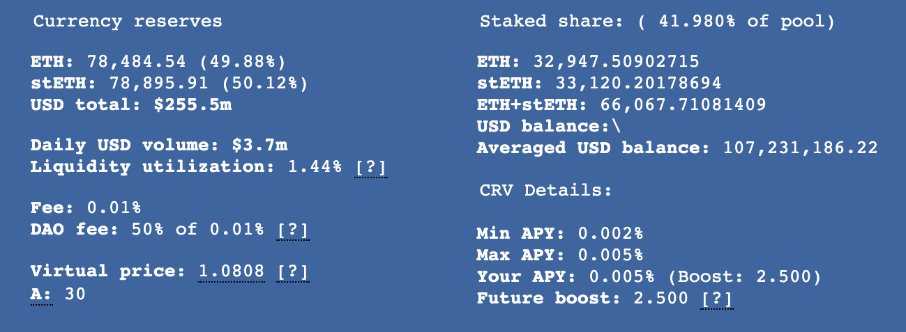

Это руководство предполагает, что читатель уже предоставил ликвидность и в настоящее время стейкает LP-токены в гейдже DAO.

Одним из главных приумуществ блокировки CRV является возможность увеличить награды на предоставленную ликвидность. Блокировка CRV позволяет получить голосующую силу для участия в DAO и заработать буст вознаграждений в CRV до 2.5x за предоставленную ликвидность на Curve.

:logos-youtube: **Увеличение ваших наград CRV**

<iframe width="560" height="315" src="https://www.youtube.com/embed/blZTCWu-DQg?si=3VPX1Tjh384D6xnQ" title="YouTube video player" frameborder="0" allow="accelerometer; autoplay; clipboard-write; encrypted-media; gyroscope; picture-in-picture; web-share" referrerpolicy="strict-origin-when-cross-origin" allowfullscreen></iframe>

## **Определение необходимого буста** {#figuring-out-the-required-boost}

Первым шагом к увеличению наград является определение необходимого количества CRV для блокировки. Каждый гейдж имеет разные требования, что означает, что некоторые пулы легче бустить, чем другие. Это зависит от количества блокированных другими и емкости гейджа ликвидности.

Калькулятор можно найти по адресу: [https://dao.curve.fi/minter/calc](https://dao.curve.fi/minter/calc)

## **Блокировка CRV** {#locking-crv}

После определения того, сколько и на сколько долго нужно блокировать, посетите следующую страницу: [https://dao.curve.fi/locker](https://dao.curve.fi/locker)

Введите сумму для блокировки и выберите дату истечения. Помните, что блокировка необратима. Количество полученного veCRV будет зависеть от суммы и продолжительности блокировки голосования.

Блокировку можно продлить, и CRV можно добавить в нее в любой момент, но иметь CRV с разными датами истечения на одном адресе невозможно.

После создания блокировки следующий шаг — применить буст.

## **Применение буста** {#applying-the-boost}

Перейдите на страницу минтера: [https://dao.curve.fi/minter/gauges](https://dao.curve.fi/minter/gauges)

Если новый буст отображается рядом с «Current boost:», то никаких дальнейших действий не требуется.

Если текущий буст не обновился, может потребоваться заявить CRV из каждого из гейджей, где предоставлена ликвидность, чтобы обновить буст. После этого буст должен быть виден.

!!!info "Блокировка вашего буста"
    Бусты обновляются только при выводе, депозите или заявлении из гейджа ликвидности.

### **Информация о бусте** {#boost-info}

Список пулов и информация о бусте/наградах были перемещены со страницы минтера. Теперь эту информацию можно найти на каждой странице пула на сайте classic.curve.fi.

<figure markdown>
  { width="400" }
  <figcaption></figcaption>
</figure>

Кроме того, эта информация также доступна в новом интерфейсе ([curve.fi](https://curve.fi/)) в разделе «Your Details» на странице пула. Примечание: Новый интерфейс пока не отображает будущий буст.

<figure markdown>
  { width="400" }
  <figcaption></figcaption>
</figure>

Посетите [**старую**](https://classic.curve.fi/pools/?see=0x0000000000000000000000000000000000000000) или [**новую**](https://curve.fi/#/ethereum/dashboard) панель мониторинга, чтобы увидеть все ваши пулы!

## **Формула** {#formula}

Механизм Boost позволяет увеличить доходность предоставленной ликвидности за счёт увеличения её **веса (earning weight)** в пулах и хранилищах (vaults). Если у вас достаточно голосового веса (veCRV), ваш коэффициент буста может достигнуть 2.5x. Это означает, что при коэффициенте буста 2.5x вклад в размере \$10,000 будет приносить награды, эквивалентные доходности от \$25,000 ликвидности в пуле. Формула для расчета вашего буста ($B$) приведена ниже. $B$ может быть максимум 2.5, поэтому если формула дает значение больше 2.5, то ваш буст равен 2.5.

$$B = 1.5 \times \frac{D \times v}{V \times d} + 1$$

Где:

* $B$ — ваш буст наград (если он больше 2.5, то он просто равен 2.5).
* $d$ — сумма вашего депозита, в USD.
* $D$ — общая сумма, внесенная в гейдж наград пула, в USD.
* $v$ — количество вашего veCRV (голосовой вес).
* $V$ — общий veCRV в системе (общий голосовой вес), нажмите [здесь](https://classic.curve.fi/usecrv), чтобы узнать текущую сумму.

