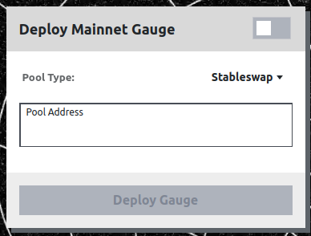
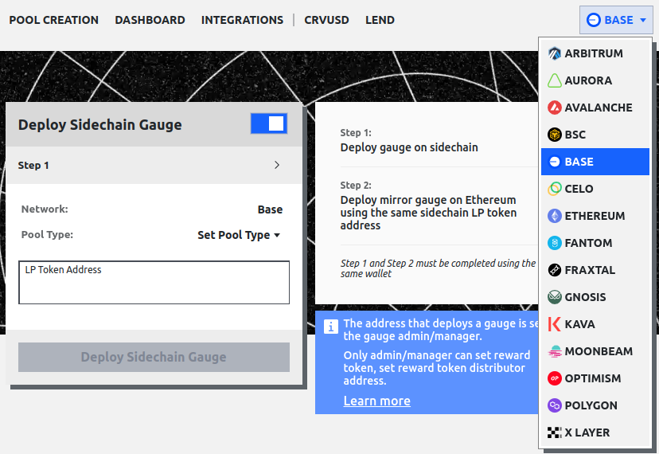
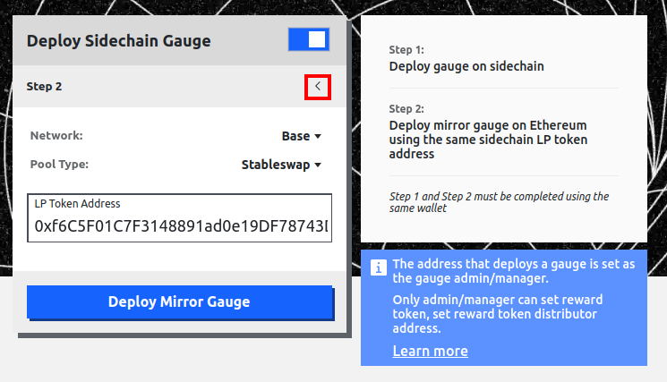
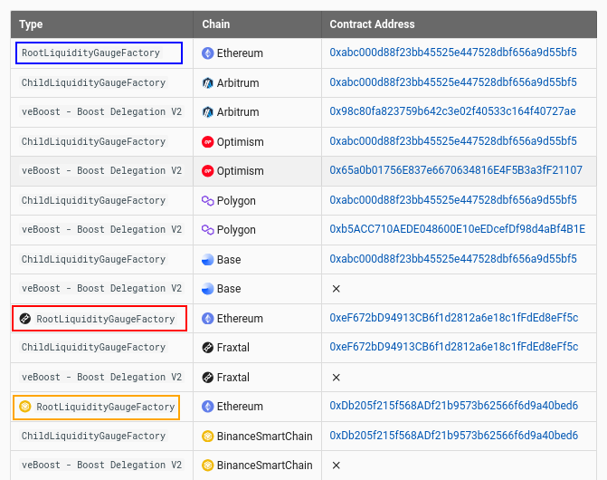
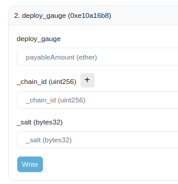
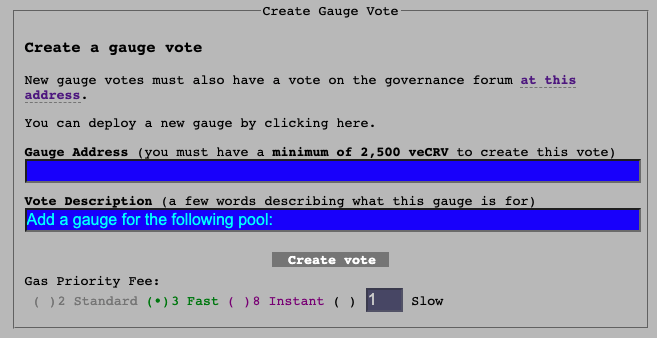

Вы можете развернуть gauge непосредственно **через интерфейс, если гейдж предназначен для пула**. Для этого перейдите по следующей ссылке: [https://curve.fi/#/ethereum/deploy-gauge](https://curve.fi/#/ethereum/deploy-gauge). Если вы хотите **развернуть гейдж для кредитного рынка**, то следуйте руководству на странице [Создание кредитного рынка](../lending/create-lending-market.md#deploying-a-gauge).

---

# **Развертывание гейджа пула через UI** {#deploying-a-pool-gauge-with-the-ui}

Перейдите на страницу Curve для развертывания гейджа здесь: [https://curve.fi/#/ethereum/deploy-gauge](https://curve.fi/#/ethereum/deploy-gauge). На этой странице есть переключатель с двумя опциями:

- [**Deploy Mainnet Gauge**](#deploy-mainnet-pool-gauge) — Развернуть гейдж для пула в основной сети Ethereum
- [**Deploy Sidechain Gauge**](#deploy-sidechain-pool-gauge) — Развернуть гейдж для пула на любой другой сети, где развернут Curve

Эти опции имеют немного разные процессы для развертывания гейджа, но обе требуют выбора правильного типа пула для развертываемого gauge.

### **Типы пулов:** {#pool-types}

- **Stableswap** — пул включающий до 8 привязанных активов, например USDC и USDT
- **Two Coin Cryptoswap** — пул с 2 волатильными активами, например, USDC и ETH
- **Three Coin Cryptoswap** — пул с 3 волатильными активами, например, USDC, ETH и CRV
- **Stableswap (old)** — старый пул с привязанными активами, например, USDC и USDT
- **Two Coin Cryptoswap (old)** — старый пул с 2 волатильными активами, например, USDC и ETH

Пул классифицируется как *старый*, если он не является пулом нового поколения (NG). Если пул был развернут с 2024 года и позже, он должен быть пулом NG. Если вы не уверены в типе пула, то попробуйте все опции при развертывании гейджа — интерфейс покажет ошибку, если выбран неправильный вариант или для пула гейдж уже развернут.

---

## **Развертывание гейджа пула в основной сети (Ethereum mainnet)** {#deploy-mainnet-pool-gauge}

Перейдите на страницу [Deploy Gauge](https://curve.fi/#/ethereum/deploy-gauge) и убедитесь, что переключатель в правом верхнем углу установлен влево, как показано ниже. Должен быть виден экран «Deploy Mainnet Gauge», как показано ниже.

{: .centered }

Просто **введите адрес пула** (0x...) и **выберите [тип пула](#pool-types) из выпадающего меню**. *Обратите внимание, что тип пула может быть выбран для вас автоматически, в этом случае его не нужно изменять*.

После ввода параметров нажмите на «deploy gauge» и подтвердите транзакцию с помощью вашего кошелька. Интерфейс покажет ошибку, если выбран неверный тип пула или для пула уже существует гейдж, так что нет риска попробовать все варианты, если вы не уверены в типе пула.

После нажатия на «Deploy» и подтверждения транзакции гейдж будет развернут. Затем можно [создать голосование для добавления его в контроллер гейджей (gauge controller)](#submit-a-dao-vote). Добавление гейджа в контроллер гейджей позволяет ему получать награды CRV для стейкеров, после того как он получает [вес гейджа](./gauge-weights.md).

---

## **Развертывание гейджа пула на сайдчейне** {#deploy-sidechain-pool-gauge}

Гейджи сайдчейна (то же самое, что гейджи L2) работают иначе, чем гейдж основной сети. У них есть гейдж на сайдчейне, который распределяет награды, а также зеркальный гейдж в основной сети Ethereum, чтобы гейдж мог получать [вес гейджа](./gauge-weights.md) и награды инфляции CRV. Это отношение родитель-дитя необходимо, потому что все управление Curve в настоящее время происходит в основной сети Ethereum.

!!!warning "Предупреждение"
    Для успешной работы процесса, gauge должен быть развернут одним и тем же адресом как  в основной сети Ethereum, так и на сайдчейне.

Чтобы развернуть гейдж сайдчейна, перейдите на страницу [Deploy Gauge](https://curve.fi/#/ethereum/deploy-gauge). Затем нажмите переключатель так, чтобы он был справа, как показано ниже, после чего будет показан экран «Deploy Sidechain Gauge» (Развертывание гейджа пула на сайдчейне).

{: .centered }

Затем подключитесь к сети, в которой вы хотите развернуть гейдж сайдчейна, это сеть, в которой находится пул. В этом примере мы выбираем Base, как показано ниже. После выбора и подключения к сети будет показан Шаг 1 развертывания гейджа сайдчейна.

{: .centered }

На Шаге 1 просто **введите адрес LP-токена** (тот же, что и адрес пула для новых пулов, но может отличаться для старых пулов) и **выберите [тип пула](#pool-types) из выпадающего меню** и нажмите **«Deploy Gauge»**. Интерфейс покажет ошибку, если выбран неправильный тип пула или гейдж уже существует для этого пула, поэтому нет риска попробовать все варианты, если вы не уверены в типе пула.

После того как гейдж был развернут на сайдчейне (называется дочерний гейдж), зеркальный гейдж должен быть развернут в основной сети Ethereum (родительский гейдж), это соединяет сайдчейн с Ethereum и управлением Curve. Чтобы перейти к Шагу 2, нажмите на маленькую стрелку, показанную в красном прямоугольнике на изображении ниже:

{: .centered }

Затем выберите сеть, в которой находится пул, нажав на выпадающее меню Network. В этом примере мы выбрали Base, так как там был развернут гейдж сайдчейна. Тот же тип пула, что и на Шаге 1, должен быть тщательно выбран на Шаге 2, так как **интерфейс не выдаст ошибку**, если выбран неправильный вариант. Затем введите адрес LP-токена (адрес пула) на L2. **Адрес LP-токена на Шаге 2 тот же, что и использовался на Шаге 1**.

После нажатия на «Deploy» и подтверждения транзакции гейдж будет развернут, и можно [создать голосование для добавления его в контроллер гейджей](#submit-a-dao-vote). Добавление гейджа в контроллер гейджей позволяет гейджу получать награды CRV для стейкеров, когда гейджу выделяется [вес гейджа](./gauge-weights.md).

---

# **Развертывание гейджа для пула в основной сети Ethereum через Etherscan** {#deploy-a-gauge-for-an-ethereum-mainnet-pool-via-etherscan}

Помимо интерфейса, есть возможность развернуть гейдж напрямую через Etherscan. Если пул был развернут недавно, проверьте [Deployment Addresses](https://docs.curve.fi/references/deployed-contracts/) для factory контрактов, в противном случае используйте транзакцию развертывания, чтобы найти, какой контракт развернул пул/кредитный рынок — это будет factory контракт.

!!!warning "Предупреждение"
    Вызов функции **`deploy_gauge`** на Etherscan будет работать только в том случае, если функция вызывается на Factory контракте, который также развернул пул.

Чтобы перейти на эту страницу, сначала найдите соответствующий Factory контракт на Etherscan. Затем перейдите в **`Contract -> Write Contract -> deploy_gauge`**. Затем введите адрес пула, для которого вы хотите добавить гейдж, нажмите на **`Write`** и подпишите транзакцию.

Перед развертыванием гейджа убедитесь, что вы подключили свой кошелек, нажав кнопку **`Connect to Web3`**.

<figure markdown>
  { width="800" }
  <figcaption></figcaption>
</figure>

---

# **Развертывание гейджа для пула сайдчейна через Etherscan** {#deploy-a-gauge-for-a-sidechain-pool-via-etherscan}

Чтобы развернуть гейдж сайдчейна, мы должны развернуть 2 разных гейджа, которые связываются вместе:

- **Дочерний гейдж** — это гейдж на сайдчейне, он развертывается первым.
- **Корневой (родительский) гейдж** — это гейдж в основной сети Ethereum, он развертывается после дочернего и связывает дочерний гейдж с основной сетью. Корневой гейдж может быть добавлен в контроллер гейджей, позволяя наградам инфляции CRV поступать в гейдж сайдчейна.

!!!warning "Предупреждение"
    При развертывании Дочернего гейджа и Корневого гейджа для пула сайдчейна их необходимо развернуть, используя **один и тот же адрес** и **одинаковое значение salt** для **обоих гейджей**. Это создает один и тот же адрес для гейджа на сайдчейне и Ethereum. Если адреса не совпадают, гейджи не могут быть связаны.

## **Развертывание дочернего гейджа сайдчейна** {#deploying-the-sidechain-child-gauge}

Чтобы развернуть дочерний гейдж сайдчейна, перейдите на [Deployment Addresses для Sidechain Gauge Factories](https://docs.curve.fi/references/deployed-contracts/#evm-sidechain-gauges).

Найдите адрес `ChildLiquidityGaugeFactory` для вашего сайдчейна и нажмите на него. Это приведет вас на страницу контракта в обозревателе блоков сайдчейна. Затем перейдите в **`Contract -> Write Contract -> Connect to Web3`**.

{: .centered }

После подключения вашего кошелька найдите функцию `deploy_gauge`. Может быть несколько функций `deploy_gauge`, это потому, что есть необязательный параметр `_manager`. Если функция не имеет этой опции, manager будет установлен на ваш адрес. Требуется, чтобы ваш адрес был менеджером для этого гейджа, иначе корневой гейдж не будет связан с этим дочерним гейджем.

{: .centered }

Чтобы вызвать функцию, сначала введите адрес `_lp_token` для пула (тот же адрес, что и адрес пула для новых пулов, но может отличаться для старых пулов). Затем введите ваш `_salt`, salt используется для создания адреса для вашего гейджа, это может быть что угодно, но **salt должен быть одинаковым при развертывании этого гейджа и позже при развертывании корневого гейджа**, подробнее о [salt здесь](https://en.wikipedia.org/wiki/Salt_(cryptography)). Введите ваш адрес в качестве `_manager`, если это требуется, затем нажмите на `Write` и отправьте транзакцию.

После подтверждения транзакции гейдж сайдчейна будет развернут.

## **Развертывание корневого (родительского) гейджа в основной сети Ethereum** {#deploying-the-ethereum-mainchain-root-parent-gauge}

После успешного развертывания дочернего гейджа сайдчейна можно развернуть корневой гейдж в основной сети Ethereum. Для этого вернитесь к [адресам развертывания фабрик гейджей сайдчейна](https://docs.curve.fi/references/deployed-contracts/#evm-sidechain-gauges). Вы должны увидеть таблицу ниже:

{: .centered }

Необходимо выбрать правильный контракт `RootLiquidityGaugeFactory` на Ethereum. Большинство корневых гейджей для сайдчейнов развернуты с использованием верхнего контракта, обведенного синим, но некоторые сайдчейны используют свои собственные специальные контракты, например, контракт для Fraxtal, обведенный красным, или контракт BSC, обведенный желтым. Если нет специфического `RootLiquidityGaugeFactory` для вашего сайдчейна, то используйте первый. После того как правильный контракт найден, нажмите на адрес, и вы будете перенаправлены на страницу контракта в Etherscan.

Снова перейдите в **`Contract -> Write Contract -> Connect to Web3`**, чтобы подключить ваш кошелек, как показано выше. **Это должен быть тот же кошелек, который развернул дочерний гейдж сайдчейна**. Затем нажмите на функцию `deploy_gauge`.

{: .centered }

В этой функции `payableAmount` можно ввести как 0, `_chain_id` должен быть идентификатором сети сайдчейна, на котором находится ваш пул и гейдж. Его можно легко найти на [chainlist.org](https://chainlist.org/). `_salt` должен быть таким же, как salt, использованный для развертывания дочернего гейджа сайдчейна.

Нажмите на `Write` и отправьте транзакцию. После этого корневой гейдж будет развернут, и процесс завершен. Теперь вы можете подать его на голосование гейджа, чтобы добавить корневой гейдж в контроллер гейджей, см. процесс ниже.

---

# **Создание голосования DAO** {#submit-a-dao-vote}

Чтобы гейдж стал допустимым для получения эмиссий CRV, он должен быть добавлен в GaugeController. Это должно быть одобрено DAO.

После того как вы создали ваш гейдж, вы можете подать его в DAO на голосование: [https://classic.curve.fi/factory/create_vote](https://classic.curve.fi/factory/create_vote).

Если гейдж предназначен для пула на сайдчейне, введите здесь адрес родительского гейджа (адрес гейджа Ethereum).

Адрес, который подает заявку, должен иметь 2500 veCRV, чтобы создать голосование.

{: .centered }

После отправки gauge начнется процесс голосования. Рекомендуется посетить форум управления, создать новую тему и объяснить, почему вашему пулу следует получить право на вознаграждения.

[Форум управления](https://gov.curve.fi/)

