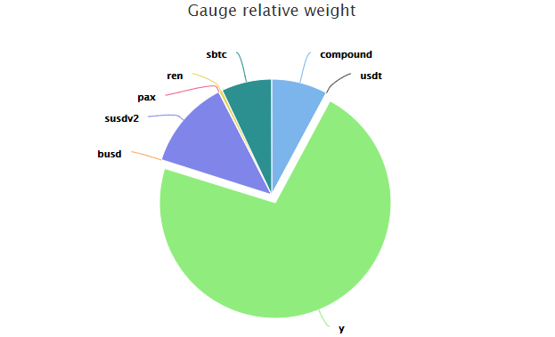

## **Что такое веса гейджей?** {#what-are-gauge-weights}

Проще говоря, вес гейджа определяет, какую часть ежедневной инфляции CRV он получает.

Например, на диаграмме ниже пул Y в настоящее время получает около 72% ежедневной инфляции CRV. Это означает, что все поставщики ликвидности в пуле Y делят между собой 72% ежедневного CRV.

Вы можете найти относительный вес каждого гейджа ликвидности на этой странице: [https://dao.curve.fi/minter/gauges](https://dao.curve.fi/minter/gauges)

## **Почему веса гейджей так важны?** {#why-are-gauge-weights-so-important}

Поскольку эти веса решают, куда направляется инфляция CRV, они позволяют DAO контролировать, куда должна идти основная часть ликвидности, и балансировать ее. Это мощный инструмент для голосующих, который должен использоваться ответственно.

Вес гейджа обновляется раз в неделю по четвергам.

## **Кто может голосовать за веса гейджей?** {#who-can-vote-for-gauge-weights}

Любой, кто [**блокировал CRV для голосования**](../crv-token/overview.md), может направить свою голосующую мощность на один или несколько пулов Curve.

## **Как я могу проголосовать?** {#how-can-i-vote}

Посетите эту ссылку: [https://dao.curve.fi/gaugeweight](https://dao.curve.fi/gaugeweight)

Выберите гейдж, которому вы хотите отдать свой голосовой вес, введите сумму в BPS (10,000 = 100% максимум) и подтвердите свою транзакцию.

## **Как часто я могу перемещать свой голосовой вес?** {#how-often-can-i-move-my-voting-weight}

Вы можете менять свой голосовой вес раз в 10 дней.

## **Что происходит, когда я добавляю дополнительные CRV к моей существующей блокировке или продлеваю время блокировки?** {#what-happens-when-i-add-additional-crv-to-my-existing-lock-or-extend-the-locktime}

Добавление большего количества $CRV к вашей блокировке или продление времени блокировки увеличивает ваш баланс veCRV. Это увеличение не учитывается автоматически в ваших текущих голосах за веса гейджей. Если вы хотите распределить всю вашу новую голосующую мощность, убедитесь, что вы проголосовали снова.

!!!warning "Предупреждение"
    Сброс веса гейджа перед повторным голосованием означает, что вам нужно будет ждать 10 дней, чтобы проголосовать за гейджи, вес которых вы сбросили. Поэтому, пожалуйста, убедитесь, что вы просто голосуете снова; нет необходимости сбрасывать ваши голоса за веса гейджей перед повторным голосованием.

