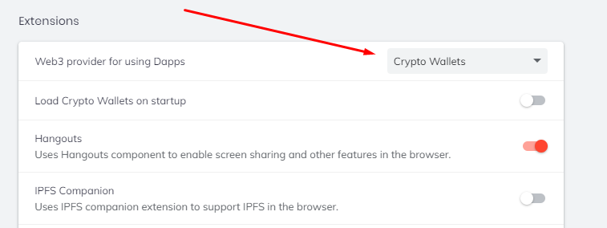

Нативное приложение "Crypto Wallets" в вашем браузере Brave может часто мешать вашему веб3-провайдеру. При использовании Metamask важно убедиться, что Brave направлен на него, а не на свою собственную реализацию.

## **Настройка Brave для работы с Metamask** {#pointing-brave-to-metamask}

Откройте ваш веб-браузер и вставьте следующее в адресную строку: _brave://settings/extensions_

Нажмите на выпадающий список и переключитесь на Metamask. Вы также можете отключить Crypto Wallets при запуске.
