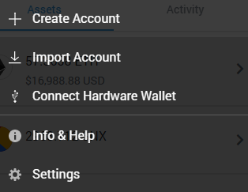
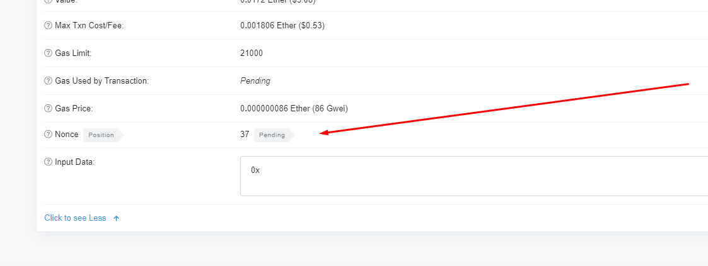

Краткое руководство по отмене и замене зависшей транзакции Ethereum.

Если вы отправили транзакцию в Metamask, и она зависла, оставаясь в статусе ожидания на Etherscan, не переживайте — это случается со многими. Существует простое решение для отмены или замены таких транзакций.

**Основные шаги**

1. **Проверьте статус**: Отменить или заменить можно только ожидающую транзакцию. Если транзакция уже обработана, её изменить нельзя.

2. **Понимание nonce**: Каждая транзакция в Ethereum имеет уникальный номер (nonce), который присваивается по порядку. Чтобы отменить или заменить транзакцию, нужно отправить новую с тем же nonce, но с более высокой ценой газа. Это сигнализирует майнерам, что новая транзакция более приоритетная, и предыдущая зависшая транзакция будет отброшена.

Этот метод особенно полезен, когда цены на газ высоки и зависшие транзакции становятся всё более распространёнными.

## **Включение пользовательского nonce в Metamask** {#enable-custom-nonce-in-metamask}

Зайдите в Metamask и выберите «Настройки», затем «Дополнительно» и прокрутите вниз, чтобы найти и включить «Настроить nonce транзакции».

## **Поиск nonce вашей ожидающей транзакции** {#finding-your-pending-transaction-nonce}

Посетите ваш адрес на Etherscan и нажмите на вашу ожидающую транзакцию. Если вы прокрутите вниз, вы найдете «Nonce»:

Запишите этот nonce и вернитесь в Metamask.

## **Замена вашей транзакции** {#replacing-your-transaction}

Теперь, когда у вас есть ваш nonce, вернитесь в Ethereum и отправьте себе 0 Ethereum, на экране подтверждения введите nonce, который вы получили из Etherscan.

Убедитесь, что на этот раз ваша цена газа подходит, проверив, например, [https://ethgasstation.info/](https://ethgasstation.info/).

Подтвердите вашу транзакцию, и все готово. Ваша транзакция на 0 Ethereum должна быть замайнена, что отменит и заменит вашу зависшую транзакцию, что вы можете подтвердить на Etherscan.

