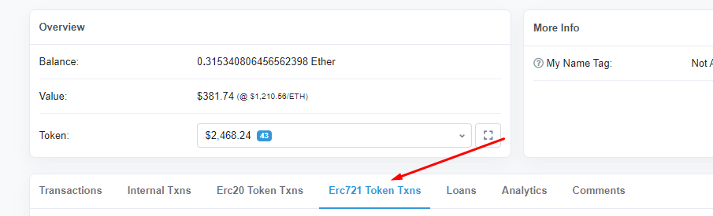
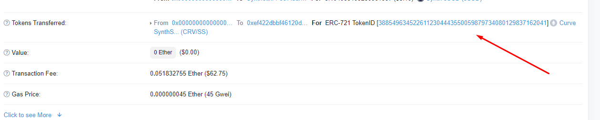

!!!info "Это очень старое руководство"
    Эта функция была прекращена более 12 месяцев назад, и эта информация предоставляется исключительно в редких случаях, когда кому-то все еще нужно восстановить кросс-активный своп из эпохи Synthetix.

Если Curve потерял транзакцию вашего кросс-активного свопа, не паникуйте, есть простой способ ее восстановить.

## **Поиск идентификатора токена**

Посетите свой адрес на Etherscan и нажмите на ERC721:

Затем нажмите на ваш последний кросс-активный своп, вы должны найти длинную строку чисел, как показано ниже:

## **Инициация восстановления**

Посетите: [https://classic.curve.fi/recover](https://classic.curve.fi/recover)

Введите идентификатор вашего токена, найденный на Etherscan, введите токен, который вы хотите получить (если ваш токен имеет sBTC, то это должен быть биткоин-токен, который разделяет пул с sBTC; если ваш токен — sUSD, то это должен быть токен, который разделяет пул с sUSD), затем нажмите «Recover».

Подтвердите транзакцию и все готово. 
