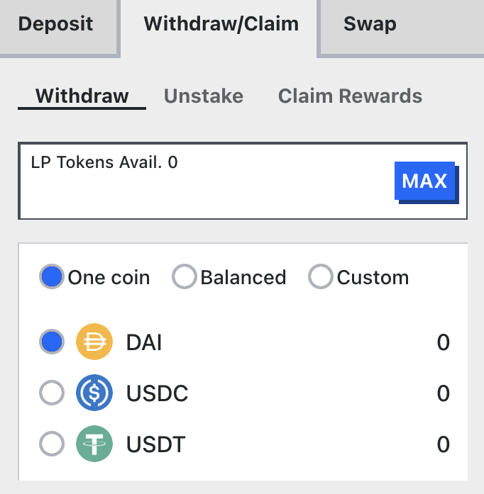

<h1>Сбор (Claiming) торговых комиссий</h1>

---
    
## **Распределение комиссий veCRV** {#fee-distribution-vecrv}

Каждый раз, когда происходит обмен на Curve Finance, **50% торговой комиссии собирается пользователями, которые блокировали свои CRV**. Более того, с момента введения стейблкоина Curve, crvUSD, часть **накопленных процентных комиссий** также направляется держателям veCRV.

По состоянию на 20 июня 2024 года, комиссии теперь **распределяются в crvUSD** вместо токенов пула 3CRV.

Комиссии собираются еженедельно из пулов, конвертируются в crvUSD и затем распределяются. См. раздел ["Как это все работает?"](./#how-does-it-all-work) для понимания процесса. Пользователи, которые блокировали CRV, могут запрашивать торговые комиссии так часто, как хотят; однако комиссии конвертируются в crvUSD только раз в неделю.

!!! info "Информация"
    Существует задержка перед первой заявкой на получение crvUSD после блокировки. Требуется ожидание 8 дней с четверга, следующего за блокировкой, перед возможностью подачи заявки.

---

## **Новый интерфейс** {#new-ui}

Чтобы заявить торговые комиссии, посетите [https://curve.fi/#/ethereum/dashboard](https://curve.fi/#/ethereum/dashboard) и нажмите кнопку **`Claim LP Rewards`**. 

<figure markdown>
  { width="300" }
  <figcaption></figcaption>
</figure>

!!! info "Информация"
    3CRV и crvUSD отображаются в этом интерфейсе, так как некоторые пользователи еще не заявили свои комиссии в 3CRV.

---

## **Классический интерфейс** {#classic-ui}

!!! warning "Предупреждение"
    Классический интерфейс не был обновлен для заявки на получение комиссий crvUSD.

    При использовании **классического интерфейса** пожалуйста, посетите: [https://classic.curve.fi/](https://classic.curve.fi/) и найдите зеленую кнопку **`Claim`** в блоке, обозначенном как **`veCRV 3pool LP claim`** внизу страницы.

<figure markdown>
  { width="700" }
  <figcaption></figcaption>
</figure>

---

# **Обмен 3CRV на стабильный коин** {#swapping-3crv-for-a-stable-coin}

!!! note "Примечание"
    **В дальнейшем 3CRV не будет распределяться как комиссия**. Последняя неделя распределения комиссий в 3CRV была 13 июня 2024 года. Однако могут быть пользователи, которые еще не заявили свои 3CRV, поэтому эта информация оставлена для них.

3CRV — это токен поставщика ликвидности (LP токен) пула 3pool, который состоит из USDC, USDT и DAI. Если пул идеально сбалансирован с соотношением 33% USDC, 33% USDT и 33% DAI, то один 3CRV будет представлять 0.33 USDC, 0.33 USDT и 0.33 DAI.

Если пользователь желает вывести 3CRV обратно в стабильный коин, он может сделать это по адресу: [**https://curve.fi/#/ethereum/pools/3pool/withdraw**](https://curve.fi/#/ethereum/pools/3pool/withdraw). Пользователю необходимо выбрать стабильный коин, который он хотел бы получить (вывод в сбалансированном или пользовательском соотношении также является опцией) и нажать **`Withdraw`**. После подтверждения транзакции он получит выведенный стабильный коин.

<figure markdown>
  { width="400" }
  <figcaption></figcaption>
</figure>

!!! note "Примечание"
    При выводе 3CRV в стейблкоин **может быть полезно обратить внимание на соотношение балансов пула**. Вывод в токен с более высоким балансом, чем два других, может привести к небольшой премии для этого токена. С другой стороны, вывод токена с более низким балансом по сравнению с двумя другими монетами может привести к получению немного меньшего количества. Дополнительную информацию можно найти [здесь](../lp/deposit-faqs.md#but-does-that-mean-i-can-still-withdraw-in-my-favorite-stable-coin).

---

# **Как это все работает?** {#how-does-it-all-work}

Когда инициируется процесс сжигания (burn), контракт собирает комиссии, которые поступают в различных формах, таких как стабильные коины, волатильные активы или токены LP. Эти токены затем сжигаются через различные контракты и пулы и конвертируются в crvUSD путем обмена на Cowswap.

Сжигание — это затратный процесс из-за сложности и количества необходимых транзакций. Однако любой может инициировать этот процесс в любое время, при условии готовности покрыть связанные с ним расходы.

Комиссии могут быть заявлены только за неделю, которая уже завершилась, так как сжигатель не может определить право каждого пользователя до окончания этого периода. Комиссии будут доступны **еженедельно, в течение 24 часов после полуночи четверга по UTC**, при условии, что кто-то — обычно команда Curve — предварительно инициировал процесс сжигания.

!!! info "Информация"
    См. страницу [Сбор и распределение комиссий](./fee-collection-distribution.md) для получения дополнительной информации об этом процессе.

