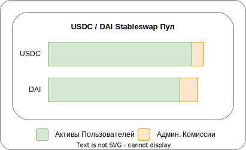
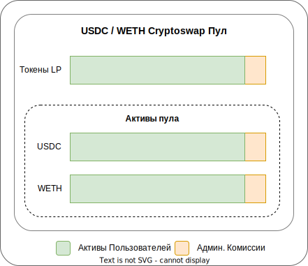
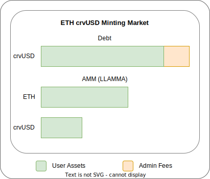
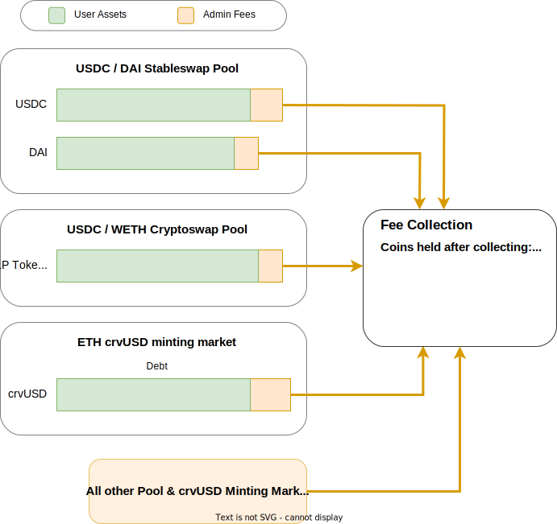
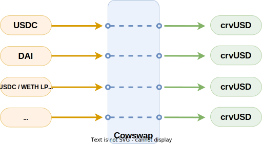

<h1>Сбор и распределение комиссий</h1>

DAO Curve зарабатывает доход от пулов и рынков эмиссии crvUSD внутри экосистемы. Каждую неделю этот доход собирается в различных токенах и обменивается на единый токен (в настоящее время crvUSD), который затем распределяется держателям [veCRV](./overview.md).

# **Административные комиссии**

Доход поступает в форме административных комиссий. Существует три различных способа их накопления и сбора:

## **Комиссии Stableswap**

Административные комиссии Stableswap составляют 50% от общей комиссии, взимаемой за использование пула Stableswap. Комиссия берется в выходном токене обмена и рассчитывается на основе конечной полученной суммы. Например, при обмене USDC на DAI комиссия взимается в DAI. Из-за этого каждую неделю каждая монета в пуле будет накапливать комиссии, которые можно собирать, например, для следующего пула административные комиссии в USDC и DAI могут быть собраны.

{ : .centered }

## **Комиссии Cryptoswap**

Административные комиссии Cryptoswap составляют 50% от общей комиссии, взимаемой за пул Cryptoswap. Поскольку пулы Cryptoswap всегда поддерживают баланс, эти комиссии накапливаются в LP токене пула, который представляет равную долю всех активов в пуле. Доли LP собираются каждую неделю для этих пулов.

{ : .centered }

## **Комиссии рынков эмиссии crvUSD**

Все накопленные процентные комиссии по задолженности на рынках эмиссии crvUSD собираются в crvUSD. Также AMM для рынков эмиссии crvUSD (LLAMMA) имеет возможность собирать административные комиссии за обмены, но в настоящее время все комиссии в этих пулах идут поставщикам ликвидности.

{ : .centered }

---

# **Архитектура сбора и распределения комиссий**

В настоящее время существует два способа сбора комиссий и их распределения. Старый способ полагается на жесткое кодирование маршрутов обмена для каждой собранной монеты и ручной сбор этих комиссий каждую неделю. Этот способ постепенно заменяется новой архитектурой, которая стимулирует третьи стороны заниматься сбором комиссий и использует [условные ордера Cowswap](https://blog.cow.fi/introducing-the-programmatic-order-framework-from-cow-protocol-088a14cb0375) для гибкой продажи любых собранных монет/токенов.

Распределение комиссий за каждую неделю происходит в четверг. Комиссии равномерно распределяются среди всех держателей veCRV и могут быть заявлены держателями veCRV в любое время. См. [Как заявить торговые комиссии veCRV](./claiming-trading-fees.md) для получения дополнительной информации.

---

## **Новая архитектура Cowswap**

Новая архитектура Cowswap основана на четырех фазах, происходящих в разные дни недели. Эти фазы: `сбор` в понедельник, `обмен` во вторник, `пересылка` в среду и `распределение` в четверг. См. ниже для подробностей о каждой фазе.

### **Сбор** - понедельник

Фаза `сбор` происходит в понедельник и гарантирует, что значительные суммы комиссий собраны и готовы к продаже на следующий день.

Новые пулы автоматически заявляют административные комиссии на протяжении всей недели, когда пользователи выводят свою ликвидность из пулов.
  
В противном случае в понедельник любой может вызвать функции, которые собирают комиссии из пулов и затем создают условные ордера на Cowswap для продажи монет/токенов во вторник. Выполнение этой работы стимулируется предоставлением вознаграждения вызывающему.

{ : .centered}

### **Обмен** - вторник

Фаза `обмен` происходит во вторник. В этой фазе условные ордера на продажу, созданные в понедельник во время фазы `сбор`, могут быть исполнены поисковиками Cowswap. Каждая монета/токен обменивается отдельно, и к концу дня все монеты и токены должны быть обменены на целевую монету (в настоящее время crvUSD).

{ : .centered}

### **Пересылка** - среда

Фаза `пересылка` происходит в среду. Все целевые монеты (в настоящее время crvUSD), обмененные во вторник, пересылаются в распределитель комиссий на основной сети Ethereum через промежуточный контракт под названием hooker. Контракт hooker — это контракт для обеспечения будущей совместимости, который может реализовать любые произвольные функции, одобренные DAO. Вызов функции для выполнения этой передачи стимулируется предоставлением вознаграждения вызывающему.

### **Распределение** - четверг

Комиссии распределяются среди держателей veCRV еженедельно в течение 24 часов после четверга 00:00 UTC. Эти комиссии равномерно распределяются среди всех держателей veCRV, которые могут заявить свою долю каждую неделю после распределения. Пользователи могут впервые заявить торговые комиссии через 8 дней после первого четверга, следующего за их блокировкой. Например, если вы блокировали во вторник, вы можете заявить торговые комиссии через 10 дней в четверг. См. [Как заявить торговые комиссии veCRV](./claiming-trading-fees.md) для получения дополнительной информации.

!!! info "Информация"
    Для получения более технической информации о новом процессе см. страницы сбора и распределения комиссий в технической документации: [https://docs.curve.fi/curve_dao/fee-collection-distribution/curve-burner/overview/](https://docs.curve.fi/curve_dao/fee-collection-distribution/curve-burner/overview/)
    
---

## **Старая архитектура**

Этот способ устарел и в настоящее время постепенно заменяется.
  
### **Сбор**
  
Сбор происходил вручную путем вызова функций вывода из пулов и рынков crvUSD.
  
### **Обмен (Сжигание)**
  
Обмен происходил вручную путем жесткого кодирования различных маршрутов обмена для каждого токена, например, для перевода wstETH в 3CRV (старый целевой токен) процесс был следующим:
  
1. `wstETH` в `stETH` через разворачивание (wstETH Burner)
2. `stETH` в `ETH` через обмен через пул stETH/ETH Curve (SwapStableBurner)
3. `ETH` в `USDT` через обмен через пул tricrypto (CryptoSwapBurner)
4. `USDT` в `3CRV` через депонирование в 3pool (StableDepositBurner)
  
Этот процесс работал хорошо, но стал громоздким, когда для каждой монеты в каждом пуле требовался маршрут обмена. Кроме того, обмены также нужно было вызывать вручную.
  
### **Распределение**
  
После завершения процесса обмена распределение происходит путем пересылки обмененных монет распределителю комиссий на основной сети Ethereum. Комиссии распределяются среди держателей veCRV еженедельно в течение 24 часов после четверга 00:00 UTC. Эти комиссии равномерно распределяются среди всех держателей veCRV, которые могут заявить свою долю каждую неделю после распределения. Пользователи могут впервые заявить торговые комиссии через 8 дней после первого четверга, следующего за их блокировкой. Например, если вы блокировали во вторник, вы можете заявить торговые комиссии через 10 дней в четверг. См. [Как заявить торговые комиссии veCRV](./claiming-trading-fees.md) для получения дополнительной информации.
    
!!! info "Информация"
    Для получения более технической информации о старом процессе см. страницы сбора и распределения комиссий в технической документации: [https://docs.curve.fi/fees/overview/](https://docs.curve.fi/fees/overview/)

