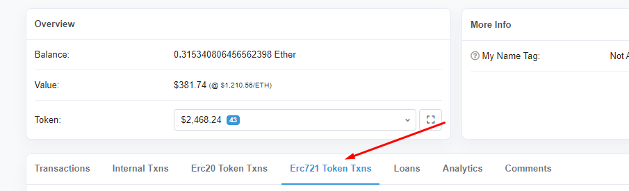
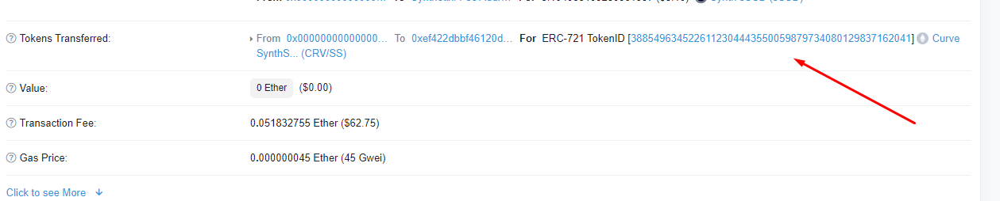

!!!info "This is a very old guide"
    This feature was deprecated more than 12 months ago and this information is provided solely in the rare event someone still needs to recover a swap cross asset from from the synthetix era.

If Curve has lost transaction of your cross asset swap, do not panic, there is a simple way to recover it.

## **Finding the token id**

Visit your address on Etherscan and click on ERC721:

And then click on your latest cross-asset swap, you should find a long string of numbers like below:

## **Initiate recovery**

Visit: [https://classic.curve.fi/recover](https://classic.curve.fi/recover)​

Enter your token id found on Etherscan, enter your the token you would like to receive (if your token has sBTC then it must be a Bitcoin token that shares a pool with sBTC, if your token is sUSD, it should be a token that shares a pool with sUSD) and then click recover.

Confirm your transaction and you're done.
